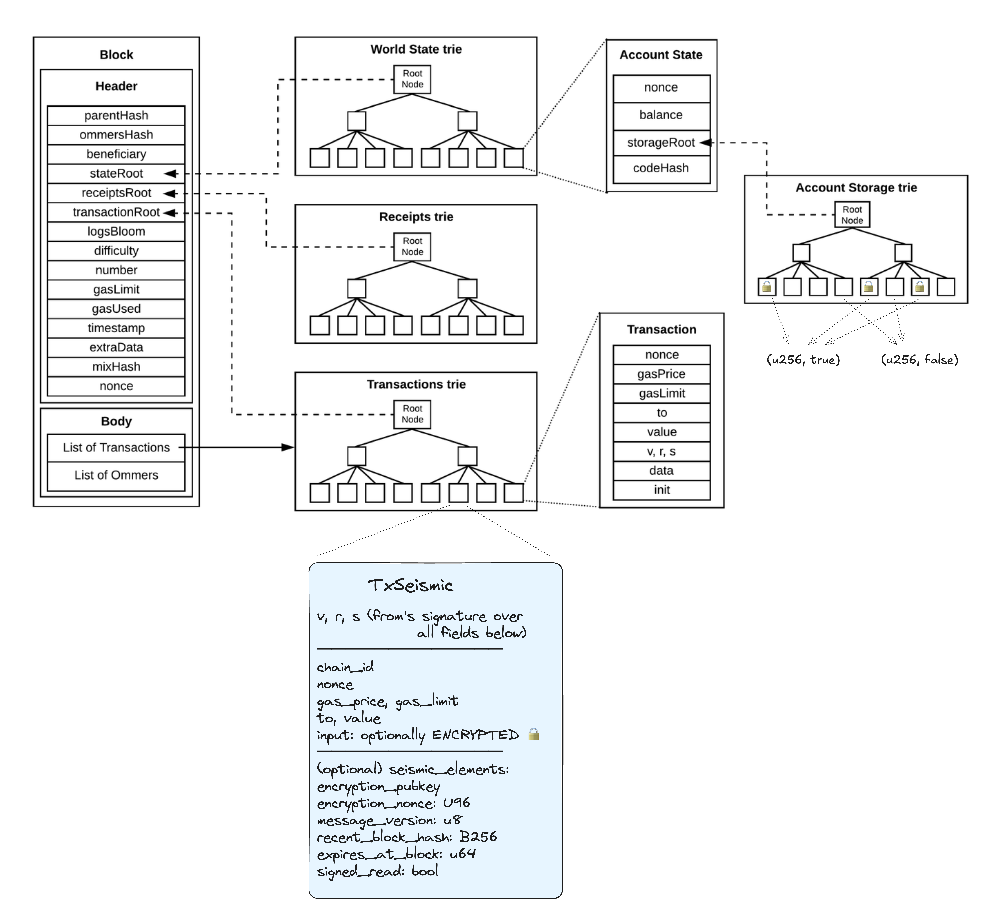

# Architecture

This page is meant to host various diagrams detailing the architecture of different Seismic components and how they fit together.

## Seismic Node

## RPC/EVM/Storage Interactions

## Tries + SeismicTx

