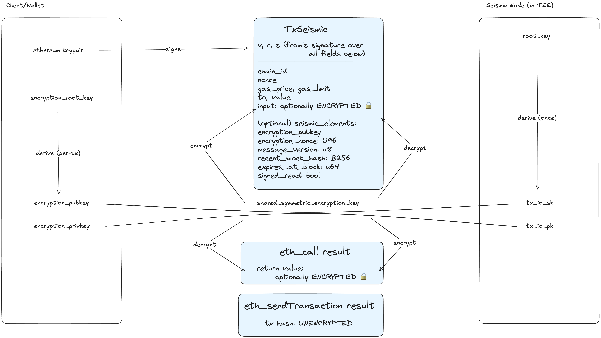

# The Seismic Transaction

<figure><figcaption></figcaption></figure>

Seismic extends Ethereum's transaction model with encrypted calldata and authenticated reads. This section covers the two core mechanisms:

* [**Tx Lifecycle**](tx-lifecycle.md) — How a Seismic transaction is constructed, encrypted, sent, decrypted, and executed. Covers key management, the `SeismicElements` metadata fields, AES encryption with AEAD, node-side decryption, and shielded storage via `CLOAD`/`CSTORE`.
* [**Signed Reads**](signed-reads.md) — How users make authenticated `eth_call` requests that prove `msg.sender` identity. Covers the motivation (preventing from-address spoofing), how signed reads are sent and validated, and the `signed_read` field that prevents replay as write transactions.
