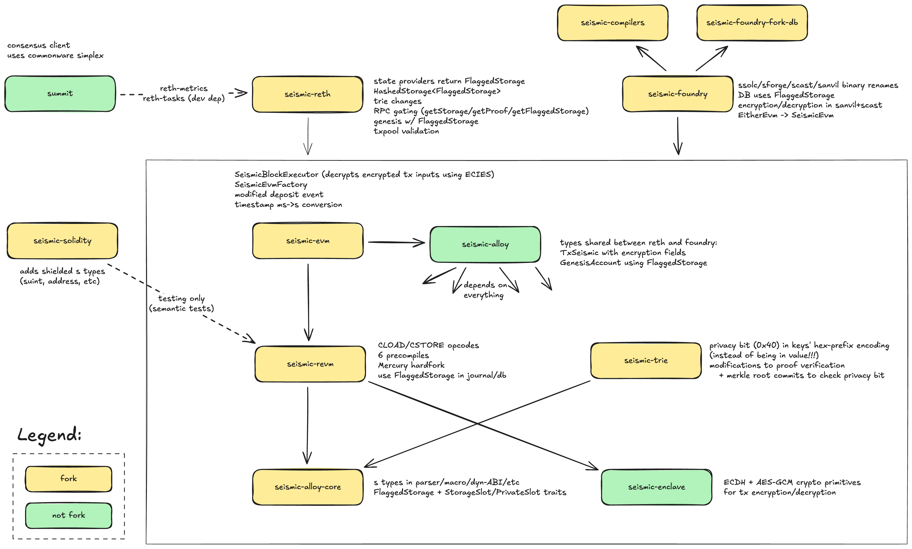

# Codebases

This document describes how the Seismic repos are organized.

## Stack Overview



## Repositories

| Repo                                                                                 | Upstream Fork                                                                 | What It Does                                                      |
| ------------------------------------------------------------------------------------ | ----------------------------------------------------------------------------- | ----------------------------------------------------------------- |
| [summit](https://github.com/SeismicSystems/summit)                                   | — (original)                                                                  | Consensus client (Simplex protocol via Commonware)                |
| [seismic-reth](https://github.com/SeismicSystems/seismic-reth)                       | [paradigmxyz/reth](https://github.com/paradigmxyz/reth)                       | Full execution client with TEE, encrypted RPC, genesis builder    |
| [seismic-foundry](https://github.com/SeismicSystems/seismic-foundry)                 | [foundry-rs/foundry](https://github.com/foundry-rs/foundry)                   | sforge/sanvil/scast dev tools                                     |
| [seismic-solidity](https://github.com/SeismicSystems/seismic-solidity)               | [ethereum/solidity](https://github.com/ethereum/solidity)                     | Compiler: adds suint, sbool, saddress shielded types              |
| [seismic-revm](https://github.com/SeismicSystems/seismic-revm)                       | [bluealloy/revm](https://github.com/bluealloy/revm)                           | Mercury EVM: CLOAD/CSTORE, 6 precompiles, flagged storage         |
| [seismic-evm](https://github.com/SeismicSystems/seismic-evm)                         | [alloy-rs/evm](https://github.com/alloy-rs/evm)                               | Seismic block execution layer                                     |
| [seismic-alloy](https://github.com/SeismicSystems/seismic-alloy)                     | — (original)                                                                  | Rust SDK: TxSeismic type, encryption-aware providers              |
| [seismic-alloy-core](https://github.com/SeismicSystems/seismic-alloy-core)           | [alloy-rs/core](https://github.com/alloy-rs/core)                             | Shielded types (suint, sbool, saddress), FlaggedStorage primitive |
| [seismic-trie](https://github.com/SeismicSystems/seismic-trie)                       | [alloy-rs/trie](https://github.com/alloy-rs/trie)                             | Merkle trie encoding for FlaggedStorage values                    |
| [seismic-enclave](https://github.com/SeismicSystems/enclave)                         | — (original)                                                                  | ECDH + AES-GCM crypto for tx encryption/decryption                |
| [seismic-revm-inspectors](https://github.com/SeismicSystems/seismic-revm-inspectors) | [paradigmxyz/revm-inspectors](https://github.com/paradigmxyz/revm-inspectors) | EVM tracing/debugging with Seismic support                        |
| [seismic-compilers](https://github.com/SeismicSystems/seismic-compilers)             | [foundry-rs/compilers](https://github.com/foundry-rs/compilers)               | Compiler integration for sforge                                   |
| [seismic-foundry-fork-db](https://github.com/SeismicSystems/seismic-foundry-fork-db) | [foundry-rs/foundry-fork-db](https://github.com/foundry-rs/foundry-fork-db)   | Fork DB with FlaggedStorage support                               |
| [seismic-client](https://github.com/SeismicSystems/seismic-client)                   | — (original)                                                                  | TypeScript client (Viem actions + Wagmi hooks)                    |

## Fork Management

Every forked repo has:

* A `seismic` branch as the default branch containing all Seismic modifications
* `main`/`master` tracking the upstream original project
* Periodic rebases or merges from upstream to stay current

To see what Seismic has changed in any repo, compare the `seismic` branch against the upstream base:

```
https://github.com/SeismicSystems/seismic-reth/compare/main...seismic
https://github.com/SeismicSystems/seismic-revm/compare/main...seismic
https://github.com/SeismicSystems/seismic-foundry/compare/master...seismic
```

## Dependency Flow

Changes flow **bottom-up** through the stack. A change in a lower layer may require updates in everything above it:

```
alloy-core change → may require trie, revm, alloy, evm, reth, foundry updates
revm change       → may require evm, reth, foundry updates
alloy change      → may require evm, reth, foundry updates
reth change       → usually isolated
```

All repos use `[patch.crates-io]` sections in `Cargo.toml` to pin specific commits of their dependencies. When updating a dependency, you need to:

1. Make the change in the upstream repo (e.g., seismic-revm)
2. Push and note the commit hash
3. Update the `[patch]` section in downstream repos (e.g., seismic-reth, seismic-foundry)
