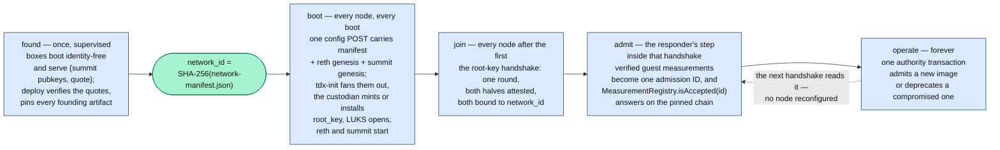

# Seismic in a TEE

Seismic nodes run inside TDX confidential VMs. That single fact drives
everything in this directory: if the execution environment is the thing being
trusted, then a node has to prove what code it is running before the network
gives it anything, and the network itself has to be a thing that can be named,
pinned, and proven against.

This README is the one-pass orientation. Read it end to end, then follow a link
when you need the depth.

## The three questions

A TEE network answers three questions, in this order:

1. **What network is this?** One hash, `network_id`, over one deploy-time
   artifact. Every attested exchange binds it, so evidence minted on one
   network can never verify on another.
2. **Where did the founding artifacts come from?** Validator keys are born
   inside TEEs before the network has an identity, and the identity pins them.
3. **Who is let in, and who decides?** A joining node asks an existing node for
   `root_key`; the responder reads the answer off the chain.

## A network's life

**Identity.** `network-manifest.json` is nine fields naming the network, and
`network_id` is the SHA-256 of its exact bytes. It pins the reth genesis, the
complete summit genesis, and the bootstrap measurement policy, so a joiner that
checks one hash has checked every founding artifact. The manifest is written
once and travels as opaque bytes to every consumer.

**Founding.** Validator keys have to exist before the manifest, or the manifest
cannot pin them. So boxes boot the measured image identity-free, a key-holder
service generates summit keypairs in RAM and proves them with a TDX quote, and
the deploy tool verifies those quotes before minting `network_id`. Founding is
rare and supervised; joining and verifying happen forever.

**The boot chain is config-gated.** Nothing on a node starts until the operator
POSTs its configuration. That one POST carries the manifest and both genesis
files; `tdx-init` writes them out, the custodian mints `root_key` (genesis node)
or installs it (everyone else), LUKS opens, and the node's own services start.

**Membership is holding `root_key`.** It is network-shared, minted once, and
handed over only through an attested handshake whose transcript binds
`network_id`. Consensus membership — a seat in the validator set — is a separate
gate, held by the summit genesis and the deposit path.

**Live policy is on chain.** The responder turns the joiner's verified
measurements into a `bytes32` admission ID and asks `MeasurementRegistry` on its
own reth, at a finalized block recent enough to prove the view is current, on
the chain `network_id` commits to. Admitting or deprecating an image is one
authority transaction and takes effect network-wide at the next handshake.

## Where the code lives

Four services, all in the [enclave](https://github.com/SeismicSystems/enclave)
repo, plus the image that measures them:

| | |
|---|---|
| `summit-key-holder` | Generates summit keypairs in RAM pre-POST, serves `{pubkeys, quote}` for harvest, persists them once LUKS opens. |
| `tdx-init` | Blocks for the config POST, validates it, fans the artifacts out to `/run/seismic/conf/`. |
| `custodian` | Owns `root_key`. No network listener, unix socket only; wraps and unwraps against verified handshake bindings. |
| `attestation-service` | Mints quotes, runs both halves of the root-key handshake, and makes the admission decision. |
| [seismic-images](https://github.com/SeismicSystems/seismic-images) | The measured TDX image, and `make measure`, whose output becomes the accepted measurement set. |

## The docs

- [network-manifest.md](network-manifest.md) — **what identifies a network.**
  The nine fields, `network_id = SHA-256(file bytes)`, the byte-exactness rule,
  what the hash commits to, the transcript bindings, and the attested addendum.
  Read it when you touch the manifest, a binding, or anything that hashes it.
- [network-founding.md](network-founding.md) — **how a network is born.** Where
  validator keys come from, why the boot chain is sequenced the way it is, the
  key holder, and what the manifest pins of summit's genesis. Read it before
  changing the boot chain or the founding flow.
- [chain-backed-admission.md](chain-backed-admission.md) — **how a node gets
  in.** The root-key handshake, the admission predicate, the readiness and
  freshness gate, and which repo owns each stage of an image release. Read it
  when working on admission, the registry, or the measurement pipeline.

Normative specs live next to the code that implements them:

- [measurement-admission SPEC.md](https://github.com/SeismicSystems/enclave/blob/seismic/crates/measurement-admission/SPEC.md)
  — the byte-exact admission rules: the Azure TDX v1 schema, policy-document
  format, admission-ID derivation, registry genesis storage, revision lifecycle.
- [seismic-images azure-measurements.md](https://github.com/SeismicSystems/seismic-images/blob/seismic/docs/azure-measurements.md)
  — the Azure guest-measurement review: what each register covers, and why the
  schema pins the ones it does.

## How these docs are written

One file per topic, in two parts: the architecture — what the thing is and how
it behaves — and then a single trailing `## Design rationale` holding the
alternatives that were weighed and set aside. **No argument appears in both
halves.** Where a decision has to be visible up front, because a reader who
misses it would undo it, the body states the rule in a sentence and links down
to the rationale.

[diagrams/README.md](diagrams/README.md) is the diagram convention for the whole
repo — mermaid first, hand-authored structured SVG only when spatial layout
carries meaning. Follow it before creating or editing any diagram.
