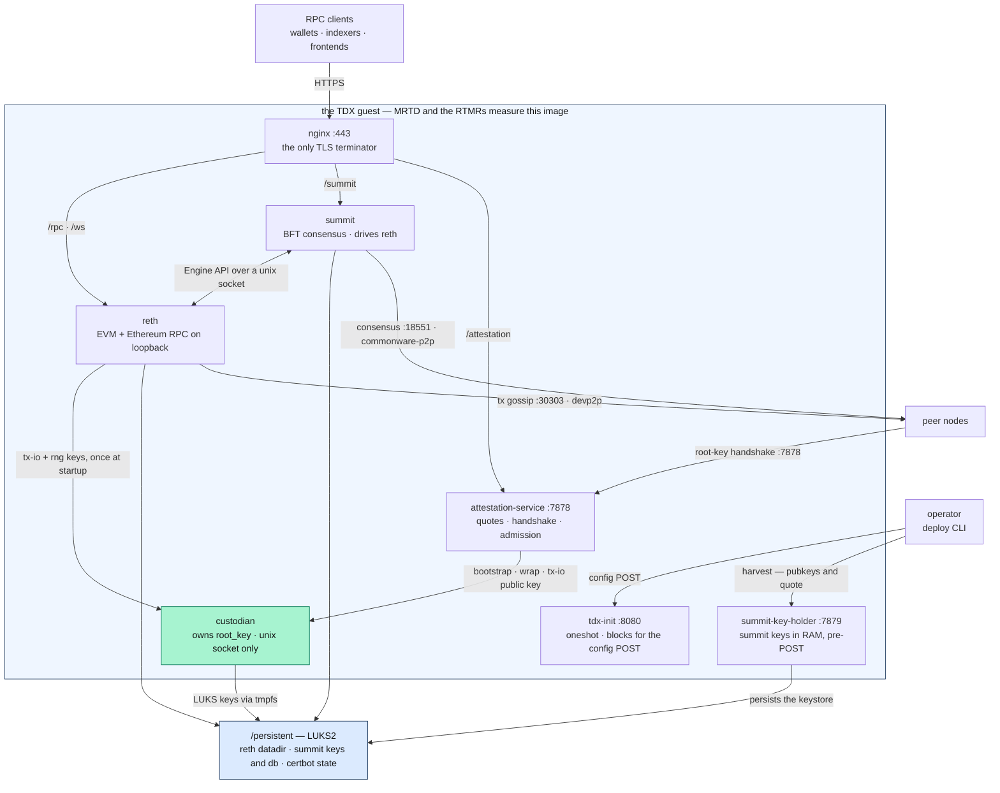
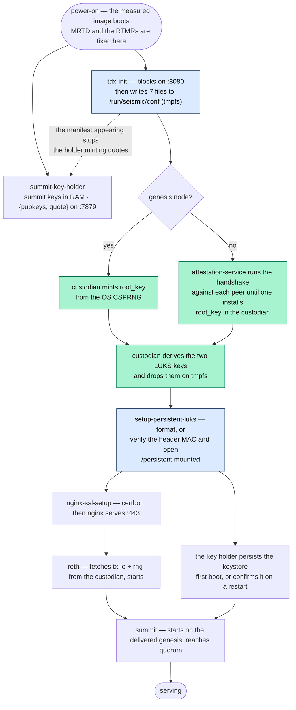

# The TEE Node <!-- omit in toc -->

**Status**: shipped. The node described here — two-process key custody, a
config-gated boot chain, three networking planes, and the attested root-key
handshake — is what a four-node network runs today. The custody split landed in
enclave #208–#219, with seismic-reth #435–#444 and seismic-images #43–#44.
Several questions around it are still open — recovery, rotation, the joiner's
appraisal, where summit's database belongs — and each is stated where it bites,
with the current default named.

What runs inside a Seismic TDX guest, what carries traffic between nodes, who
holds which key, what survives a reboot, and how a node gets from power-on to
serving. The general node
architecture — RPC, EVM, storage, tries — is [architecture.md](../architecture.md);
this doc is the TEE-specific shape around it.

Nothing here is a key derivation. Every label, salt, and KDF belongs to
[the key schedule](../key-schedule.md); this doc names each key, says which
process holds it, and says what anchors it.

- [Summary](#summary)
- [The processes](#the-processes)
- [What the outside can reach](#what-the-outside-can-reach)
  - [Three networking planes](#three-networking-planes)
- [Who holds which key](#who-holds-which-key)
  - [Key custody: one process holds `root_key`](#key-custody-one-process-holds-root_key)
  - [Per-purpose keys](#per-purpose-keys)
  - [The keys](#the-keys)
  - [Client traffic: encrypting to `tx_io_pk`](#client-traffic-encrypting-to-tx_io_pk)
  - [The root-key handshake](#the-root-key-handshake)
- [`/persistent`: the LUKS volume](#persistent-the-luks-volume)
- [Boot: power-on to serving](#boot-power-on-to-serving)
- [Design rationale](#design-rationale)

## Summary

- **One process holds the network secret.** `root_key` lives in the custodian
  and nowhere else. It has no network listener and no async runtime, and every
  other process asks it for one named operation over a Unix socket.
- **The custodian takes an authorization, never evidence.** It never parses a
  quote, a certificate chain, or platform collateral. Whoever decides that a
  peer may have `root_key` hands over a verified transcript binding, and the
  custodian acts on it.
- **`root_key` is never written to disk.** Every boot obtains it fresh: minted
  once on the network's first node, fetched from a peer everywhere else,
  forever.
- **Attestation binds keys, not channels.** Every confidentiality property comes
  from an application-layer key whose provenance a TDX quote endorses. TLS on
  the public port is hygiene for browsers and wallets.
- **Nothing starts until the operator POSTs the configuration.** `tdx-init` is
  the gate: it blocks, validates one config document, and fans it out to tmpfs.
  Every later unit finds its inputs on disk before it starts.
- **Three planes carry inter-node traffic**, each with its own identity key,
  discovery, and trust posture, so an eclipse of one never cascades into
  another.

## The processes

Six long-lived processes, and the oneshots that gate them, all measured into the
image:



| Process | What it owns |
| --- | --- |
| `tdx-init` | The config gate. Serves one HTTP POST on `:8080`, validates it, and writes seven files into `/run/seismic/conf/`: the network manifest, the reth genesis, the summit genesis, and four per-service env files. The directory is tmpfs, so this repeats every boot. |
| `custodian` | `root_key`, in memory only. Derives per-purpose keys, wraps `root_key` for an authorized peer, and drops the LUKS keys for the disk-setup script. |
| `attestation-service` | Every quote the node mints or verifies. Runs both halves of the root-key handshake, makes [the admission decision](chain-backed-admission.md), and serves tx-io evidence and node status. Holds no key material. |
| `summit-key-holder` | Summit's consensus keypairs. Generates them in RAM before any configuration exists, serves `{pubkeys, quote}` for [the founding harvest](network-founding.md), and persists them once `/persistent` is mounted. |
| `reth` | Execution: the EVM, Ethereum JSON-RPC, chain state, and the tx-gossip plane. |
| `summit` | Consensus: BFT voting, checkpoints, and reth's forkchoice over the Engine API. |
| `nginx` | TLS termination and path routing to loopback backends. Its certificate key is generated in the guest and renewed by certbot. |

Unit ordering, users, groups, and flag-by-flag rationale live with the image
that ships them, in the
[seismic image module](https://github.com/SeismicSystems/seismic-images/blob/seismic/modules/seismic/readme.md).

## What the outside can reach

One port is the whole public API surface, and one more is peer-facing. The rest
is either loopback or restricted to the operator's own address range by the
node's cloud firewall rules
([the port table](https://github.com/SeismicSystems/deploy/blob/main/tee/pulumi/seismic_node/__main__.py)).

| Port | Source | What answers |
| --- | --- | --- |
| `:443`, `:80` | anyone | nginx, proxying `/rpc` and `/ws` to reth, `/summit` to summit's JSON-RPC (health, checkpoints, staking and deposit queries), `/attestation` to the attestation service, and `/metrics/reth` + `/metrics/summit` to the two Prometheus endpoints |
| `:7878` | anyone | the attestation service directly: the root-key handshake, tx-io evidence, health, and first-boot disk-provisioning progress |
| `:18551` | anyone | summit's consensus plane |
| `:30303` TCP+UDP | anyone | reth's devp2p plane |
| `:8080` | operator only | `tdx-init`'s config POST |
| `:7879` | operator only | the key holder's `{pubkeys, quote}` |

The peer-facing ports are open because admission is decided at the application
layer, not by an address list: commonware-p2p completes a handshake only with a
validator-set pubkey, and the root-key handshake carries its own mutual
attestation. An address allowlist would add nothing and would break validators
that join later.

Two ports are operator-only and permanently so, because both come back on every
boot: `/run` is tmpfs, so `tdx-init` waits for a fresh POST each time, and the
key holder mints fresh RAM keys until it finds the keystore. Whoever reaches
`:8080` first configures the box, which is why the founding window is a
supervised operation —
[founding-window security](network-founding.md#founding-window-security).

reth's RPC (`:8545`), its WebSocket (`:8546`), and both metrics endpoints bind
loopback only. reth's public namespace list is `eth,net,web3`, and its general
IPC-RPC server is disabled, so `admin`, `debug`, and `txpool` have no path to
the outside; the `seismic` namespace registers alongside `eth`.

### Three networking planes

Each plane has its own identity key, its own discovery, and — deliberately — its
own trust posture, so a compromise or eclipse of one never cascades into
another.

| Plane | Port | Protocol | Identity key | Discovery | Membership |
| --- | --- | --- | --- | --- | --- |
| Consensus | `:18551` | commonware-p2p | Ed25519 | none: the validator set itself | closed — the peer set *is* the validator set |
| Tx gossip | `:30303` TCP+UDP | devp2p: RLPx + discv5 | secp256k1 | the cohort from the config POST as discv5 bootnodes *and* RLPx trusted peers, then the discv5 DHT | open to anything carrying the `seismic` fork id |
| Enclave peer RPC | `:7878` | JSON-RPC over HTTP | none standing | the same bootnode list, as `http://<host>:7878` | attested per exchange |

**Consensus.** BLS12-381 signs consensus messages and Ed25519 is the transport
identity. There is no discovery: peer addresses come from the validator set, so
membership and the peer set are the same thing. commonware-p2p authenticates by
pubkey, so only a set member completes a handshake.

**Tx gossip.** The identity is reth's own `discovery-secret`, under LUKS, so the
node's `enode://` address is stable for its life. Discovery is discv5 only —
discv4 and DNS discovery are off — keyed by the `seismic` ENR fork id, so
Seismic nodes match only each other. The cohort is operational data, delivered
per boot in the config POST and never part of the hashed manifest; one live
bootnode is enough for discv5 to flood the rest.

One enode list feeds both of reth's devp2p flags, because the two do different
jobs with it. `--trusted-peers` is how a node reaches the cohort: direct RLPx
dials, retried, and exempt from reputation slashing. `--bootnodes` is how it
reaches everyone else — it seeds discv5, and the DHT floods the rest, including
joiners that no founding-era list could have named. Keeping both matters because
discv5 bootstrap is one-shot: reth resolves a bare `enode://` with a live UDP
round-trip at startup and never retries a lost one, so on the discovery path
alone a single dropped packet could cost a node its seat in the mesh until the
next reboot. Both flags are re-delivered every boot, since the conf dir is
tmpfs.

Open membership on this plane is safe by construction, in three independent
ways:

- **`GetNodeData` and `NodeData` are hard-rejected** as bad messages, because
  raw trie nodes would carry FlaggedStorage values straight past the RPC
  layer's private-slot redaction.
- **Sync never follows devp2p** — summit drives reth's forkchoice over the
  Engine API — so eclipsing this plane costs transaction liveness, never
  safety.
- **The payload is ciphertext**: a gossip peer learns timing and size, nothing
  else.

**Enclave peer RPC.** There is no standing transport identity here. Each
exchange carries its own attestation and its own AEAD in the message body, so
the channel is deliberately plain HTTP. Peers are derived, not configured
separately: `tdx-init` takes one bootnode list, drops this node's own entry, and
renders every consumer from what remains:

- **reth's `--bootnodes`** and **`--trusted-peers`**, both the peer enodes.
- **`http://<host>:7878` per peer** for the root-key fetch.

All of them name the same machines by construction, so skew between the lists is
unrepresentable, and a non-genesis node POSTed with no usable peer fails the
POST rather than booting with no way to obtain `root_key`
([`peers.rs`](https://github.com/SeismicSystems/enclave/blob/seismic/bin/tdx-init/src/peers.rs)).

Browsers reach the attestation service through nginx's `/attestation` route
instead, since mixed-content rules bar a plain-HTTP fetch from an HTTPS origin.
The TLS hop is hygiene, not a boundary: the evidence a browser fetches is
verifiable on its own.

## Who holds which key

Every confidentiality property on the node traces back to a key, and every key
is either `root_key`, derived from it, or the VM's own randomness. This section
is the custody boundary around `root_key`, what gets derived behind it, where
every key lives, and the two attested exchanges that move key material between
machines: a client encrypting to `tx_io_pk`, and a joining peer fetching
`root_key` itself.

### Key custody: one process holds `root_key`

`root_key` is 32 bytes of network-shared secret, and holding it is what makes a
machine part of the network's privacy trust domain. Every long-lived node secret
except the per-VM ones is derived from it.

It lives in exactly one process:

```
seismic-attestation-service (user: attestation)
  · JSON-RPC on :7878; holds no key material
  · connects out to /run/seismic/custodian/custodian.sock for key operations

seismic-custodian-service (user: custodian)
  · owns root_key in process memory: not Clone, zeroizing, no raw getter
  · listens on the unix socket only — no network listener, no tokio
  · writes the per-boot LUKS keyfile to /run/seismic/custodian/luks-keys
```

Two OS users, two systemd units, two binaries. reth and the attestation service
reach the custodian only over its socket, and each asks for exactly the
operations it needs.

There is no seal or unseal operation. At-rest protection is the mount layer's
job — one volume key, handed over once per boot — so no bulk data ever routes
through the process that holds `root_key`.

**The custodian never parses evidence.** It receives a *verified
authorization*: the 32-byte digest of a handshake transcript that somebody else
has already checked against admission policy. Calling `WrapRootKey` **is** the
authorization assertion, and the custodian cannot re-check it — by design, since
re-checking would mean hosting the DCAP, X.509, and collateral-fetching stack
next to `root_key`
([`root_key_wrap.rs`](https://github.com/SeismicSystems/enclave/blob/seismic/crates/custodian/src/root_key_wrap.rs)).
Who produced the authorization, and against which policy, is invisible to it.
That is what lets the joiner-side appraisal change without reopening the custody
boundary.

**Two layers gate the socket.** The image decides who may connect: the socket
directory is `2750 custodian:custodian-ipc`, so only members of the
`custodian-ipc` group reach it at all. The custodian then decides what a
connected UID may call. Its ACL is deny-by-default, and the grants arrive as
`--allow <user>:<purpose>,…` on the `ExecStart` line, next to the user
definitions in the same measured image — so a grant and the user it names cannot
drift apart, and there is no runtime mutation path
([`acl.rs`](https://github.com/SeismicSystems/enclave/blob/seismic/bin/custodian-service/src/acl.rs)).
Usernames resolve to UIDs once at startup, and an unresolvable name fails the
boot rather than surfacing later as a mysterious deny.

The shipped grants:

| User | Granted purposes | Why exactly these |
| --- | --- | --- |
| `reth` | `tx-io`, `rng` | reth holds the tx-io keypair and the RNG input material for its process lifetime; it decrypts calldata during execution. |
| `attestation` | `tx-io-public`, `create-root-key-bootstrap-attempt`, `wrap-root-key`, `install-root-key-from-verified-bootstrap-response` | Everything the handshake needs, and public-only tx-io access for minting evidence. The network-facing process must never reach `tx_io_sk`. |
| — | `snapshot` | Ungranted. The purpose exists in the key schedule; no process serves state transfer yet, so nothing may derive `K_snap`. |

Requests are one method per purpose, never bundled, because the method is the
unit a grant covers. `Ping` is open to anyone who can connect and carries no key
material.

**The wire is length-prefixed CBOR**, framed before any content is parsed and
capped at a 64 KiB body
([`custodian-ipc`](https://github.com/SeismicSystems/enclave/tree/seismic/crates/custodian-ipc)).
The protocol is byte-dominated — keys, digests, ciphertexts — and CBOR carries
raw bytes natively, so there are no hand-written hex or base64 codecs next to
`root_key`. The server is synchronous, one thread per connection, sized for the
two or three long-lived local clients that actually call it.

**The no-tokio property is enforced by the build, not by a comment.** The IPC
crate has `client` and `server` features, and cargo's feature unification would
quietly pull tokio into the custodian if it ever compiled in the same invocation
as a client. So the image builds the custodian in its own `cargo` call and then
asserts on the dependency tree, failing the image build if tokio appears
([`mkosi.build`](https://github.com/SeismicSystems/seismic-images/blob/seismic/modules/seismic/mkosi.build)).

**`root_key` is never written to disk**, and two consequences follow directly.
Every restart re-obtains it, so the peer handshake is the standing mechanism by
which the network distributes `root_key` — not a one-time bootstrap. And a
network that loses every node at once loses `root_key` permanently: there is no
on-disk and no on-chain copy. Operationally, at least one node must stay up
through maintenance windows, regional outages, and any change that would reboot
every VM together. Recovery for that case is open design work; the current
answer is the operational rule.

Replacing `root_key` with fresh entropy is likewise open: a network today mints
one and keeps it. Whatever shape that takes, the custodian's part is additive —
a rotate method, with the peer handshake wrapping the newest version — because a
new method is the only way anything reaches `root_key` at all.

The whole custody surface is around 1,500 lines: the custody crate plus the
service binary that hosts it, with no attestation stack, no HTTP stack, and no
async runtime in either.

### Per-purpose keys

The custodian derives a key per purpose and per epoch, and hands the derived key
to its caller in plaintext. reth fetches the tx-io keypair and the RNG input
material once at startup and holds them for its process lifetime.

**Epochs are parametric in the API and fixed at 0.** There is no periodic
rotation — why not is in the [design rationale](#design-rationale). Manual
rotation stays available as an operator response to a compromise: new
transactions use the new epoch's key, and the leaked key only ever decrypts
history that was already encrypted under it. What advances the epoch is a
consensus event, and that mechanism is not built.

**reth names the mechanism, not the key.**
`--seismic.purpose-keys-source <custodian|built-in>` selects where reth looks;
`custodian` is the default and what TEE deployments run, fetching over
`--seismic.custodian.socket` with bounded retries. The retries are
load-bearing: systemd ordering guarantees the custodian has *started*, not that
it holds `root_key` yet, and on a joining node that waits on the peer handshake.
reth rejects a served tx-io keypair whose public key is not the secret key's — a
node must never advertise a key whose traffic it cannot decrypt
([`keys_source.rs`](https://github.com/SeismicSystems/seismic-reth/blob/seismic/crates/seismic/node/src/keys_source.rs)).
`built-in` selects keys compiled into the binary: real, consensus-visible keys
with zero secrecy, which is what pre-TEE networks run on. Those two are the only
sources, so a pre-TEE network that wants keys of its own — not the ones published
in the repository — needs a third one. That is open work.

**Summit's keys are not custodian-managed**, and that is a custody-model
distinction rather than an omission. The custodian guards one network-shared
secret and its derivatives; summit's BLS12-381 and Ed25519 keys are independent
per-VM randomness, with a different consumer and a different lifecycle. They are
also born before the custodian exists — the founding harvest needs them
pre-manifest — which is why `summit-key-holder` owns them, running as the summit
user and writing a keystore only summit reads
([the key holder](network-founding.md#the-key-holder)).

### The keys

`root_key` is the parent of the first family. Every key below is either derived
from it — network-shared, identical on every node — or drawn from the VM's own
randomness and unique to it. The diagram shows the two families side by side on
two validators; the table then says where each key lives and what anchors it.
[The key schedule](../key-schedule.md) owns every derivation and label.


| Key | Family | Lives | Anchored by |
| --- | --- | --- | --- |
| tx-io secp256k1 | network-shared | derived in the custodian, held by reth for its process lifetime | a TDX quote over `(network_id, tx_io_pk, epoch)`, served by `getTxIoAttestationEvidence` |
| RNG precompile input material | network-shared | derived in the custodian, held by reth | consensus: the precompile's outputs are in the chain |
| snapshot AES-256-GCM (`K_snap`) | network-shared | derivable, held by nothing today | transitively by `root_key` |
| LUKS volume key | network-shared | derived per boot, handed over on tmpfs, then shredded | transitively by `root_key` |
| LUKS header MAC key | network-shared | same handoff, same lifetime | transitively by `root_key` |
| summit BLS12-381 | per-VM random | born in RAM in the key holder, persisted under `/persistent/summit/keys` | the harvest quote at founding; the validator set the manifest pins, or the deposit path afterwards |
| summit Ed25519 | per-VM random | same | same, and it is the commonware-p2p peer id |
| reth devp2p secp256k1 | per-VM random | generated by reth at `<datadir>/discovery-secret`, inside LUKS | nothing — transport identity only; its public form is served by `seismic_nodeInfo` |
| nginx TLS certificate key | per-VM random | generated in the guest, stored with certbot's state inside LUKS | Let's Encrypt, renewed on a timer |

The per-VM keys are stable for the life of the node because they sit on the LUKS
volume — the enode a peer dialed yesterday still answers today.

### Client traffic: encrypting to `tx_io_pk`

`root_key`'s first purpose is the key clients encrypt to. One recipient key per
network per epoch, derived by every custodian and identical on all of them, so a
client encrypts once and any node can execute the result.

This exchange is attested in one direction only: the client is not a TEE and has
nothing to prove. It fetches `{tx_io_pk, epoch, evidence}` from the attestation
service's `getTxIoAttestationEvidence`, where the quote's `report_data` carries a
binding over `(network_id, tx_io_pk, epoch)` — the guest stating that this key
belongs to this network at this epoch. The client then runs the same ECIES encap
the root-key handshake uses, and submits the sealed calldata in a TxSeismic
envelope. Its layout, the signed-read variant, and what goes into the AAD are
[the transaction reference](https://docs.seismic.systems/reference/seismic-transaction/tx-lifecycle).
Both fetch and verification happen at most once per epoch: `tx_io_pk` and its
evidence are cached for the epoch's life.

Plaintext calldata therefore exists in exactly two places, the client and a
guest, and decryption happens as late as it can — in the block executor for
state-changing transactions, so a transaction stays encrypted in the mempool and
across the gossip plane, and at the RPC layer for signed reads.

**This is also why a node cannot sync its way in.** Re-executing any historical
block that carries a TxSeismic needs `tx_io_sk`, which needs `root_key`. Seismic
history is not readable from outside the trust domain, which is what makes the
root-key handshake — not a sync protocol — the thing that grants membership.

**Client-side quote verification is open.** The evidence endpoint and its
binding are shipped, but the SDKs read `tx_io_pk` from a node's
`seismic_getTeePublicKey` RPC and appraise no quote, so a client trusts the node
it asked. Closing that means the verifier — quote chain, platform collateral, and
the registry's accepted set, all of which anyone can read — shipping inside the
client libraries.

### The root-key handshake

One round, both halves attested, both bound to the same `network_id`. This
section is the cryptography; the responder's policy decision inside it —
verified measurements to an admission ID to `MeasurementRegistry.isAccepted`,
and the freshness gate around that read — belongs to
[chain-backed admission](chain-backed-admission.md), which also has the
step-by-step sequence.

**Construction.** ECIES on secp256k1: ECDH gives a shared secret, HKDF-SHA256
over it with the handshake's own domain label gives an AES-256 key, and
AES-256-GCM wraps `root_key` under a fresh random 12-byte nonce. This is the
same primitive stack TxSeismic uses, with the requester's per-session ephemeral
pubkey playing the role `tx_io_pk` plays for transaction submission. Mutual TDX
attestation is grafted onto it: the requester's quote binds its ephemeral
pubkey, and the responder's binds its own ephemeral pubkey **and** the wrapped
ciphertext.

**Both ephemeral secrets stay in a custodian.** The requester's custodian mints
the keypair and retains the secret, handing the network-facing service only the
public half and an opaque attempt id; the responder's custodian mints its own
and drops it after the wrap. The attestation service on either side never holds
a key that could open the ciphertext it is carrying
([`bootstrap.rs`](https://github.com/SeismicSystems/enclave/blob/seismic/bin/attestation-service/src/bootstrap.rs)).

What the construction buys:

- **One primitive stack, shared with TxSeismic.** secp256k1 ECDH →
  HKDF-SHA256 → AES-256-GCM. One implementation, one audit surface, one set of
  cross-language test vectors. No second curve, no HPKE alongside ECIES.
- **End-to-end secrecy.** `root_key` transits under a key derivable only by the
  two custodians. A compromised attestation service on either side can neither
  read the response nor substitute a key of its own.
- **Freshness.** The requester's 32-byte nonce is fresh per handshake and bound
  into both quotes and the AEAD's AAD, so no captured quote or response replays
  onto a later exchange.
- **Key binding.** The transcript each quote attests names an ephemeral pubkey
  whose secret sits in the local custodian. Another process in the same guest
  cannot substitute its own key and reach the plaintext: the wrap and install
  methods are granted to one user, and the install path needs the attempt the
  custodian retained.
- **Ciphertext integrity beyond the AEAD tag.** The responder's quote commits to
  the wrapped bytes themselves, so tampering after the quote is signed is
  detectable independently of the tag.
- **Transcript binding on unwrap.** The verified request binding is the AEAD's
  AAD. The requester recomputes it from its own copies of the transcript rather
  than trusting the response to echo it, and hands that to its custodian to
  unwrap with, so a wrapped key lifted from any other handshake fails to open.
- **Forward secrecy.** Both ephemeral secrets are dropped after the exchange, so
  a later compromise of a long-lived key does not decrypt a captured handshake.
- **Transport independence.** Confidentiality, integrity, freshness, and
  authentication all live in the request and response bodies. Plain HTTP is a
  choice, not a compromise — why the alternative was set aside is in the
  [design rationale](#design-rationale).

The responder's side of the appraisal is live policy read from the chain. The
requester's side is not yet: it confirms a genuine Azure TDX guest for this
exact transcript, and applies no measurement policy, because a node without
`root_key` cannot read the chain to find one. The planned anchor is the
network's own key commitment rather than a measurement list —
[the two positions](chain-backed-admission.md#the-network-manifest-as-the-joiners-root-of-trust).

The asymmetry is not an accident, and it is the seam where a different bootstrap
model would plug in. The responder's check is load-bearing in every model:
verifying the joiner's quote **is** the decision to release the secret. The
requester's is not — it only needs to be sure it is talking to the canonical
network, which a signature or a commitment can establish as well as a fresh
quote can. Adopting one would make this exchange one-directional rather than
mutual, with the responder still attesting the joiner, and it would not touch the
custodian's API: an authorization goes in either way.

## `/persistent`: the LUKS volume

One LUKS2 volume holds everything a node keeps across boots: reth's datadir,
summit's keystore and database, and certbot's certificates. Its unlock key is
derived from `root_key`, so the volume is readable only by a guest that the
network has admitted. No human and no cloud operator ever holds the unlock
material, and there is no TPM seal to migrate or scrub.

The volume is formatted `aes-xts-random` with a 512-bit key and dm-integrity
HMAC-SHA256. The random per-sector IVs are the point: they close the
snapshot-diff watermarking and equality-oracle attacks that deterministic XTS
allows. cryptsetup does not expose random-IV storage without the integrity
layer, so the HMAC comes bundled — and brings tamper-evidence with it.

**The header is MAC'd into the volume.** An attacker with disk write access can
flip the header's cipher to `cipher_null`; the keyslot KDF still validates
against the real unlock key, and dm-crypt then writes plaintext to disk
([CVE-2025-59054 / CVE-2025-58356](https://blog.trailofbits.com/2025/10/30/vulnerabilities-in-luks2-disk-encryption-for-confidential-vms/)).
So first boot computes `HMAC(header_mac_key, canonical_json({segments,
keyslots, digests}))` and stores it as a custom `seismic-header-mac` LUKS2
token. Every later boot copies the header to tmpfs, recomputes the MAC over the
same subset, compares, and opens with `--header` pointing at that verified copy
— which closes the window between checking the header and configuring dm-crypt.
A mismatch refuses the mount. Tokens are outside the MAC's scope, so storing
the token cannot invalidate it
([`setup-persistent-luks`](https://github.com/SeismicSystems/seismic-images/blob/seismic/modules/seismic/mkosi.extra/usr/bin/setup-persistent-luks)).

First boot also wipes the whole device to seed the integrity tags, which takes
an hour or more on a multi-TB disk. The script publishes byte progress to tmpfs
and the attestation service serves it as `getLuksProvisioningStatus`, because it
is the only HTTP-serving process alive for the whole wipe.

**Where summit's database belongs is open.** Today `/persistent/summit/db` rides
the volume and inherits its tamper-evidence. It has no at-rest secrecy
requirement — consensus state is broadcast data, and block payloads are
TxSeismic ciphertext either way — so it could sit outside. That
tamper-evidence, which LUKS provides and a plain filesystem does not, is the
one consideration; rollback protection is absent in both placements, so the
delta is targeted at-rest tampering only. Summit's *keys* stay inside the volume
in either outcome. Inside is the current default.

## Boot: power-on to serving

Every unit past `tdx-init` waits on the config POST, directly or through a
dependency. The chain below is identical on a genesis node and a joiner except
at one step, and identical on a first boot and a restart except that the disk is
already formatted.



The attestation service binds `:7878` only once the custodian holds `root_key`,
so an open port is the readiness signal the deploy tooling waits on — a peer or
an operator never meets a listener whose key operations cannot succeed. The
first bootstrap call doubles as the readiness probe and the state query: a
custodian that already holds the key answers `RootKeyAlreadyPresent` and the
service goes straight to serving.

The custodian writes the LUKS keyfile the moment it holds `root_key`, before the
key is observable over the socket, so a present `root_key` always implies the
handoff has happened. The disk script polls for that file, uses the first 32
bytes as the unlock key and the second 32 as the header MAC key, and shreds it.

Multi-node founding adds one requirement to this chain — every founding
validator's summit keys must exist before `network_id` is minted, which is why
the key holder starts in parallel with `tdx-init` rather than after it.
[Network founding](network-founding.md) owns that story.

**The genesis flag is minting authority, not consensus standing.** Exactly one
node in a new network is configured to mint `root_key`; in an N-node founding
all N are genesis validators, and N−1 of them are root-key joiners. Two minting
nodes would produce incompatible LUKS volumes and divergent tx-io keys — a
silent network fork — so the founding tooling configures a whole cohort in one
step, where exactly one minting node is representable.

Three roles get called "the leader" and are worth keeping apart. The **minting
node** is the one that generates `root_key` and then serves it to the rest. The
**orchestrator** is the operator machine that provisions boxes, harvests
pubkeys, and POSTs configuration; it holds no secrets at all, because the
founding keys are TEE-born and it only ever sees public halves and quotes. The
**genesis validator set** is every founding node equally — the minting node has
no special consensus standing, and validators that arrive later join through the
deposit path instead.

**Whether `root_key` provenance should be a consensus decision is open.** Today
it is a peer exchange: one node mints, and everyone else asks a peer that already
holds it. Making consensus arbitrate would move the two-minting-nodes footgun
from tooling into the protocol. Any such design meets one structural constraint
first: summit's keys live in a keystore on the volume `root_key` unlocks, so
summit cannot sign before LUKS opens, and LUKS cannot open before `root_key`
arrives. Breaking that cycle means either moving validator identity out of that
volume, or narrowing consensus arbitration to rotation and leaving the first mint
where it is.

A second axis, independent of the first, is whether admission should be
two-phase: verify a node once, issue it a durable credential, and let later
fetches be cheap. It is attractive for exactly the reason above — a RAM-only
`root_key` forces a fresh verification on every reboot — and it trades
measurement freshness for credential expiry and revocation machinery. Today
every fetch is one verify-and-release exchange.

**Clear the flag after the genesis node's first successful boot.** It is
correct exactly once, for the very first boot of a brand-new network. On a
restart with the flag still set, the custodian mints a *fresh* `root_key`, whose
derived keys no longer match the volume — and the header-MAC check catches that
before `cryptsetup open`, so the unit refuses to mount and restart-loops until
the operator updates the config and re-POSTs. Loud failure, not a silent fork.
A precedence-aware bootstrap would make the flag harmless; see the
[design rationale](#design-rationale).

**State transfer between nodes is designed, not built.** Two nodes that both
hold `root_key` can replicate state by shipping a snapshot encrypted under
`K_snap`, which is why the snapshot purpose is in the key schedule. No process
serves it today, and the purpose stays ungranted until one does, so nothing on
the node can derive that key. A node without a snapshot syncs from consensus.

## Design rationale

Alternatives weighed and set aside, with the reasons that decided them. Each
names the section whose rule it settles.

**A separate custodian process rather than one enclave service**
([key custody](#key-custody-one-process-holds-root_key)). The split's whole job
is to keep the untrusted-evidence parser — DCAP, vTPM, X.509, collateral
fetching over TLS — away from `root_key`. That parser has to exist somewhere on
the responder side of any peer bootstrap, in every bootstrap model, because
verifying the joiner's quote *is* the secret-release decision. Putting it in a
different process with a different OS user means a compromise there leaks
per-purpose derived keys for the lifetime of those processes, never the network
secret itself.

**An authorization in, never evidence**
([key custody](#key-custody-one-process-holds-root_key)). Handing the custodian
a verified transcript binding rather than raw evidence is what makes the
boundary outlive its bootstrap model: a mutual-attestation verifier today and a
different admission check later are the same input from inside the custodian.
The attestation service is therefore specified by the authorization it emits,
not by its internals — which is also why a second network-wide secret, if one is
ever adopted, arrives as a new custodian method rather than a redesign.

**Length-prefixed CBOR rather than JSON-RPC over the socket**
([key custody](#key-custody-one-process-holds-root_key)). The candidate RPC
stack has no Unix-socket server transport, so the glue would have been
comparable in size to the whole CBOR server — and it would park a
general-purpose RPC framework next to `root_key`. The protocol is bytes, which
CBOR carries natively and JSON does not. The cost is a non-human-readable wire,
paid off by a debug CLI behind a feature flag.

**Pass the derived key in plaintext, with no periodic rotation**
([per-purpose keys](#per-purpose-keys)). The alternative is an operation proxy:
the custodian decrypts each ciphertext and never releases `tx_io_sk`. It is a
real improvement in blast radius and stays available as a purely additive
method — but it puts per-transaction traffic through a synchronous
thread-per-connection socket sized for a handful of local clients, and the
current threat model does not require it. Periodic rotation was rejected on its
own terms: it bounds nothing under pass-plaintext, and it charges every client
an epoch-tracking cost.

**Summit's keys outside the custodian**
([per-purpose keys](#per-purpose-keys)). Hosting them there would invert the
custodian's design. Their holder has to serve pubkeys to the outside world
pre-manifest and pre-admission — the most exposed moment in the node's life —
while the custodian must never listen at all, and hosting them would drag a BLS
dependency into the process that owns `root_key`. The custody models also
differ: one
network-shared secret and its derivatives, versus independent per-VM randomness
with its own consumer.

**`root_key` in RAM only, with no on-disk backup**
([key custody](#key-custody-one-process-holds-root_key)). Sealing it to the
platform would buy restart independence at the cost of a second sealing policy
that must track the measurement policy, unknown vTPM clone and rollback
semantics, and sealed-blob migration machinery. The price is the liveness rule
stated above, which comparable confidential-compute networks accept too. A
recovery design that does not reintroduce a durable copy of the secret is open
work, and that is why the constraint is stated wherever it bites rather than
buried.

**A `root_key`-derived LUKS key rather than a TPM-sealed one**
([the volume](#persistent-the-luks-volume)). A TPM-sealed volume key unlocks for
whoever holds the platform, which is exactly the party the threat model excludes.
Deriving it from `root_key` means the disk is readable only by a guest the
network admitted, and it collapses two problems into one: whatever protects
`root_key` protects the volume. It also means a wrong `root_key` fails at the
header MAC rather than mounting a volume full of unreadable state.

**Attestation bound to keys rather than to channels**
([the handshake](#the-root-key-handshake)). RA-TLS would attest the transport,
leaving every property one hop removed from the data it protects: a client would
have to trust that the attested endpoint is the same thing that holds the
decryption key. Binding the quote to the key instead makes the chain from quote
to protected data a single cryptographic hop, and it makes the transport
replaceable — which is what lets the peer plane run plain HTTP and the public
plane run a stock CA certificate.

**ECIES on secp256k1 rather than HPKE on X25519**
([the handshake](#the-root-key-handshake)). Seismic already runs an ECIES path
on secp256k1 for TxSeismic, with implementations and known-answer vectors in
Rust, TypeScript, and Python. Adopting a second curve and a second construction
for the bootstrap would double the audit surface to buy a cleaner standard, for
a protocol whose peers all ship in the same release.

**Loud failure on a stale genesis flag rather than a precedence-aware bootstrap**
([boot](#boot-power-on-to-serving)). Fetch-first, mint-only-on-failure would
make the flag harmless on a restart. But it needs an answer to "how long do we
wait for peers before minting?", and every answer is a way to fork the network
by timeout. A header-MAC failure that wedges one node until the operator fixes
its config is the better trade.

**Three planes rather than one multiplexed transport**
([the planes](#three-networking-planes)). One transport with one identity would
be less machinery, and would couple the failure domains: eclipsing it would cost
consensus, gossip, and bootstrap together, and the identity key would inherit
the strictest requirement of all three. Separate planes let each keep the
posture it actually needs — a closed pubkey-authenticated set for consensus,
open membership for gossip, per-message attestation for bootstrap.
