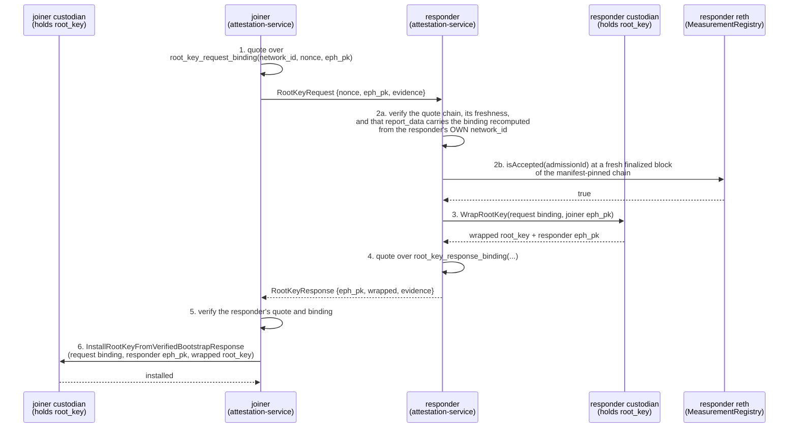
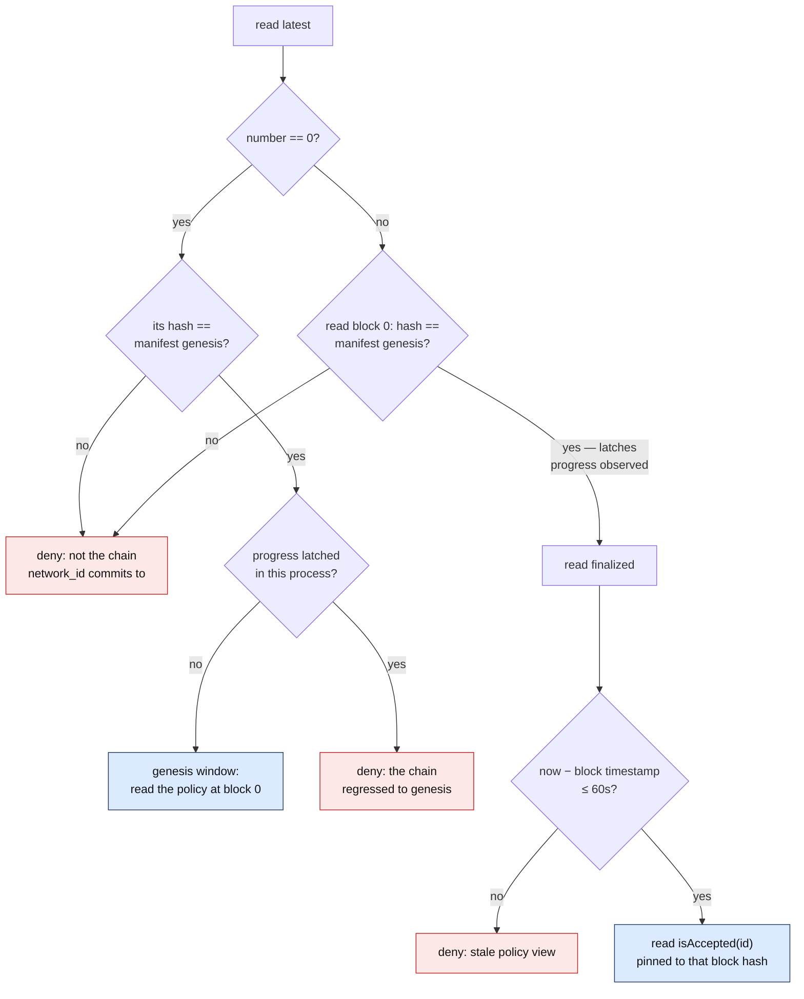
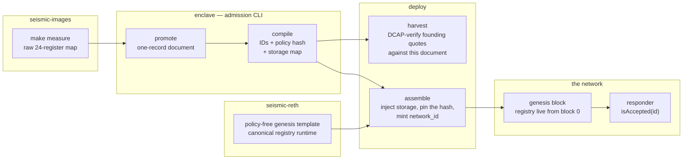

# Chain-Backed Admission <!-- omit in toc -->

**Status**: responder path shipped (2026-08, enclave #242–#245), except the
manifest-pinned genesis check, which is in review.

How a new node is let into a Seismic network, and why the decision is read
from the chain. A joining node asks an existing one — the responder — for
`root_key`, in a single attested round. Both halves appraise each other the
same way, verifying the evidence and then applying a policy to the verified
guest, but only the responder has a live policy to apply:

| | Evidence verification (cryptographic) | Admission appraisal (policy) |
| --- | --- | --- |
| **Responder** admits the joiner | quote chain + platform collateral + `report_data` bound to the responder's own `network_id` | `MeasurementRegistry.isAccepted(id)`, read at fresh finalized state of the manifest-pinned chain — [`RegistryAdmission`](https://github.com/SeismicSystems/enclave/blob/seismic/bin/attestation-service/src/admission.rs) |
| **Joiner** admits the responder | the same check, opposite direction | none yet — [`DangerouslyAdmitAnyAzureGuest`](https://github.com/SeismicSystems/enclave/blob/seismic/bin/attestation-service/src/admission.rs) passes any Azure TDX guest unconditionally. A joiner cannot read the chain before it holds `root_key`, so its appraisal is planned as provenance against the network's `tx_io_pk` commitment rather than a measurement policy, and is not yet code |

Nothing here is normative. The byte-exact rules are the
[measurement-admission SPEC](https://github.com/SeismicSystems/enclave/blob/seismic/crates/measurement-admission/SPEC.md),
cited below by section; this doc is the cross-repo story around them.

- [Summary](#summary)
- [Where admission sits in the join](#where-admission-sits-in-the-join)
- [The readiness and freshness gate](#the-readiness-and-freshness-gate)
- [The network manifest as the joiner's root of trust](#the-network-manifest-as-the-joiners-root-of-trust)
- [Cross-repo wiring](#cross-repo-wiring)
  - [One image release, end to end](#one-image-release-end-to-end)
- [Design rationale](#design-rationale)

## Summary

Holding `root_key` is what makes a machine part of the network's privacy
trust domain, so the root-key handshake is where membership is granted, and
admission is one step inside it: the responder verifies the joiner's
attestation evidence, turns the verified guest measurements into one
`bytes32` admission ID, and asks `MeasurementRegistry.isAccepted(id)` on its
own reth.

Five properties follow from that shape:

- **The chain is the responder's live policy source.** Admitting a new image
  or deprecating a compromised one is one authority transaction; it takes
  effect at the next handshake, network-wide, with no node touched.
- **The policy read is anchored twice — to the network, and to now.** The
  registry is read on the chain `network_id` commits to, at a finalized block
  whose timestamp is recent, so a responder holding a substituted chain or a
  stale view stops admitting rather than serve the wrong allowlist.
- **One implementation defines the predicate.** The compiler that seeds
  genesis storage is the same library the responder derives IDs with, so the
  two halves cannot disagree about what an admission ID means.
- **The registry stores opaque IDs.** The contract never sees a PCR or a JSON
  byte, so a new attestation backend costs a new schema and one policy
  revision, never a contract change.
- **The joiner anchors on the manifest instead.** Before it holds `root_key` a
  joiner cannot read the chain, so its side of the handshake rests on
  [the manifest](network-manifest.md) and the bootstrap policy document that
  hash pins — [the two positions](#the-network-manifest-as-the-joiners-root-of-trust).

## Where admission sits in the join

The root-key bootstrap is one round, both halves attested, both bound to the
same `network_id`. Admission is the responder's step 2 — after the evidence
verifies, before the custodian wraps anything.

What each step establishes:

- **Evidence generation** binds the transcript into the quote, so a quote
  proves the guest minted it for *this* request on *this* network
  ([the network manifest](network-manifest.md) has the binding layouts and how
  `report_data` carries them). Quotes are per-request, and on Azure each one
  costs seconds of exclusive vTPM access — which is why a refused joiner's
  retry is expensive, and why the responder retries a transient chain failure
  inside the handshake instead of failing it.
- **Verification** is cryptographic only: the attestation backend checks the
  quote chain and the platform collateral for the evidence's own attestation
  type, and checks `report_data` against the binding the responder recomputes
  from its own `network_id` and the request's claimed fields. A quote minted
  on a clone network, or replayed from an earlier request, fails here.
- **Admission** appraises the typed verified measurements. Which attestation
  types are acceptable is the predicate's call, not the backend's: today only
  an Azure TDX guest has a schema, and every other verified variant is
  denied. Verification and admission are one operation — no API hands back
  verified measurements without a predicate verdict, so there is no
  "verified but unappraised" path to reach by mistake ([SPEC §11](https://github.com/SeismicSystems/enclave/blob/seismic/crates/measurement-admission/SPEC.md#11-consumer-obligations)).
- **Wrapping** happens in the custodian, a separate local process with no
  network listener. Calling `WrapRootKey` *is* the authorization assertion;
  the AEAD's AAD is the verified request binding, so the ciphertext belongs
  to this handshake and no other.
- **Installing** is the symmetric call on the joiner's own custodian. Raw
  evidence never crosses into it: `InstallRootKeyFromVerifiedBootstrapResponse`
  takes only the already-verified request binding, the responder's ephemeral
  key, and the wrapped ciphertext, and unwraps using that same binding as AEAD
  AAD — so a wrapped key from any other handshake fails to unwrap here.

Consensus membership — a seat in the validator set — is gated separately, by
whose pubkeys are in the summit genesis and by the deposit path. See
[network founding](network-founding.md).

## The readiness and freshness gate

A registry read that returns `true` is necessary, not sufficient: the answer is
worth exactly as much as the chain it came from, and as that chain is current.
The threat it leaves open is the reason the gate exists: an operator deprecates
a compromised image, and a responder that is lagging, partitioned, eclipsed —
or reading a chain that is not the network's at all — keeps admitting on an
allowlist the network has left behind. Emergency deprecation must not be
bypassable by holding one node back, or by handing it a different chain.

The responder therefore decides only at chain state it can prove is both this
network's and current:

The decisions behind it:

- **The chain itself is checked first.** A registry read is worth no more than
  the chain it runs against, and that chain arrives as a genesis file the
  operator POSTs, so every decision compares block 0 against the manifest's
  `eth.genesis_hash` and refuses if they differ. Each verdict then traces back
  to `network_id` — [the network manifest](network-manifest.md) covers why that
  comparison belongs in the guest, at the point of use.
- **The finalized tag, not latest.** A finalized block cannot reorg away, so
  an admission can never rest on state that later disappears. Summit
  publishes finality on every forkchoice update, trailing head by a block or
  two, so this costs nothing in healthy operation.
- **A timestamp bound, not a height bound.** An eclipsed node cannot see the
  true head, so no comparison of heights detects its own staleness. The
  finalized block's timestamp against the guest's wall clock is the one
  locally checkable witness that this view of the allowlist is current. The
  bound is 60 seconds; seismic block timestamps are milliseconds.
- **The read is pinned to the block that passed the check.** `isAccepted` is
  answered at exactly the finalized block hash, not at whatever `latest`
  became a moment later, so the freshness proof and the policy answer
  describe the same state.
- **The genesis window.** A chain still at block 0 has no finality to publish
  and a genesis timestamp that is arbitrarily old. Reading the policy there is
  reading the policy `network_id` itself commits to — the genesis check above
  is what makes those the same thing — and no deprecation can predate the
  chain, so this is what lets the founding cohort join before consensus
  starts. The window latches shut for the rest of the process the first time
  the chain is seen past genesis: a reth back at block 0 after progress has
  been wiped or replaced, and must not admit on its say-so. The latch lives in
  the deciding process, so an operator who wipes reth and restarts the service
  reopens the window — bounded by the genesis check to the founding accepted
  set, and covered below.
- **Every failure denies.** An unreachable reth, a chain that is not this
  network's, a missing finalized block, a stale view, a chain back at genesis,
  a failed registry read, and a false `isAccepted` all refuse the join.
  Everything but the last is the responder failing to *decide* rather than a
  verdict on the joiner, so the joiner is told admission is unavailable and
  knows to ask another peer. Those that time can fix are also retried a few
  times inside the handshake: the joiner's quote is already spent, and a reth
  that is restarting or just catching back under the bound deserves a couple
  of seconds before the joiner has to start over. A registry verdict is final
  and never retried; so is a genesis mismatch, which no waiting repairs.

**Where the gate lives**: inside the admission decision itself
([`admission.rs`](https://github.com/SeismicSystems/enclave/blob/seismic/bin/attestation-service/src/admission.rs)),
evaluated per handshake — which is also what makes the pinned read possible,
since the state that was checked and the state that answers must be the same
block. Why it does not sit in front of the port instead: [design
rationale](#design-rationale).

**What the gate does not defend against**: a host that controls its guest's
clock while eclipsing it can have an honest enclave compute a fresh-looking
verdict; a host that rewinds its guest's chain view to block 0 lands in the
genesis window, bounded by the genesis check to the founding accepted set; and
one responder's yes is enough — the handshake requires no corroboration across
independent responders. Deprecation therefore takes effect network-wide
against every adversary except one holding host control of a node that already
holds `root_key`. All three residuals are accepted host influence under the
TEE threat model; [the trust model](trust-model.md#accepted-risks) states each
plainly, with the rollback family the second belongs to and the freshness
evidence that would close them.

## The network manifest as the joiner's root of trust

The two sides of the handshake reach for different anchors, because they are
in different positions. The responder holds `root_key` and runs a synced
node, so it can read live state. The joiner holds nothing yet: it cannot
read the chain, because reading Seismic state at all is what `root_key`
buys. What it does hold is the manifest the operator POSTed to it.

Two of the fields it pins do the work here: the bootstrap policy hash, which is
the joiner's copy of the founding accepted set, and the genesis hash, which is
how a responder knows the chain it reads the live policy on. `network_id`
covers both representations of that founding set — the document a joiner can
read, and the registry genesis storage a responder reads — byte-exactly, so
anyone holding the two can recompute that they agree
([SPEC §8](https://github.com/SeismicSystems/enclave/blob/seismic/crates/measurement-admission/SPEC.md#8-registry-genesis-storage)).
The derivation and the field table are in
[the network manifest](network-manifest.md).

After genesis the two diverge on purpose: the contract carries the live policy,
the document stays frozen as the record of what the network founded on. That is
exactly why the responder never reads it.

## Cross-repo wiring

One stage per repo, each owning an artifact the next one consumes:

| Stage | Repo | What it owns |
| --- | --- | --- |
| Measured image, and the review behind the register set | seismic-images | `make measure` output (all 24 registers per build) and the [Azure guest-measurement review](https://github.com/SeismicSystems/seismic-images/blob/seismic/docs/azure-measurements.md). |
| The predicate: promotion, compilation, admission-ID and genesis-storage derivation | enclave | [`measurement-admission`](https://github.com/SeismicSystems/enclave/blob/seismic/crates/measurement-admission/) — a library and the `seismic-measurement-admission` CLI, plus the SPEC and its golden vectors. |
| Admission at join time, and the freshness gate | enclave | [`attestation-service`](https://github.com/SeismicSystems/enclave/blob/seismic/bin/attestation-service/src/admission.rs), reading the chain through the narrow `isAccepted` binding in `measurement-registry-client`. |
| The registry contract and its artifact | seismic | [`MeasurementRegistry.sol`](../../contracts/src/enclave/MeasurementRegistry.sol), its [tests](../../contracts/test/MeasurementRegistry.t.sol), and the published artifact the genesis builder consumes. |
| Policy-free genesis templates | seismic-reth | The [genesis builder](https://github.com/SeismicSystems/seismic-reth/tree/seismic/crates/seismic/genesis-builder) and its [contract manifest](https://github.com/SeismicSystems/seismic-reth/blob/seismic/crates/seismic/chainspec/res/genesis/manifest.toml): the registry ships with canonical runtime and empty storage, which fails closed. |
| Genesis assembly, and revision deltas | deploy | [`tee/cli`](https://github.com/SeismicSystems/deploy/tree/main/tee/cli): promote, compile, inject the storage map, and prove genesis consistency. |

Two boundaries hold each artifact to one implementation: the enclave repo
carries only the registry's read interface, held to the canonical ABI by a CI
check, and deploy shells out to the admission CLI rather than reimplementing
promotion and storage derivation in Python. What a second copy of either would
cost is in the [design rationale](#design-rationale).

### One image release, end to end

Read as a sequence: `make measure` emits the raw register map for a build.
`promote` narrows it to the schema registers as a one-record document —
strictly, and it compiles its own output, so a bad promotion fails at image
release rather than at genesis. That document is the founding accepted set;
harvest already appraises the founding cohort's quotes against it, before
any chain exists. `compile` turns it into the accepted IDs, the policy hash,
and the complete registry storage map. `assemble` writes the map verbatim
into the policy-free genesis template's registry account, pins the document
hash in the manifest, and mints `network_id` over the whole set. From block
0 the registry answers `isAccepted` for exactly those IDs, and every
responder's verdict is one `eth_call` away.

Admitting a later build repeats the first two stages and then diffs: compile
the next complete document, take `accept = ids(new) − ids(old)` and
`deprecate = ids(old) − ids(new)`, and drive one `applyPolicyUpdate` through
the authority ([SPEC §10](https://github.com/SeismicSystems/enclave/blob/seismic/crates/measurement-admission/SPEC.md#10-revision-lifecycle)). No genesis, no restart, no node reconfigured.

## Design rationale

Alternatives weighed and set aside, with the reasons that decided them. Each
names the section whose rule it settles.

**Chain state rather than a policy file on every node** ([where admission sits
in the join](#where-admission-sits-in-the-join)). A local file makes the
allowlist as current as the least-updated node's filesystem, and turns an
emergency deprecation into an operator sweep across every box with no way to
know when it finished. On chain, one authority transaction moves the whole
network at once, the update is atomic and revision-numbered, and the events are
the audit trail. What a responder can still get wrong is *staleness*, a much
narrower problem than distribution, and the freshness gate closes it.

**No local-artifact fallback when the chain read fails** ([the readiness and
freshness gate](#the-readiness-and-freshness-gate)). A second source would be a
second answer: a node with an edited or simply old file could admit what the
network has deprecated, and the fallback would be reached exactly when the chain
path is unavailable — the moment the node should be refusing. The bootstrap
document keeps the roles the chain cannot serve: the founding input, the
manifest-pinned anchor for a joiner that has no chain access, and the
human-readable record governance reviews. The manifest does keep a job on the
responder, and it is not policy: it names which chain and which contract to ask.
Identity, not allowlist — which is why a manifest frozen at founding can stay
authoritative for a read whose answer changes every revision.

**Per-handshake evaluation rather than a gate in front of the port** ([the
readiness and freshness gate](#the-readiness-and-freshness-gate)). A systemd
ordering constraint or a health check would only decide whether the service
starts serving, so a node that goes stale hours later would keep admitting. It
would also break the pinned read, since the state that was checked and the
state that answers have to be the same block.

**Opaque IDs on chain rather than measurements the contract can read**
([cross-repo wiring](#cross-repo-wiring)). The contract holds `status[bytes32]`
and nothing else — no JSON, no PCR maps, no enumeration on the hot path.
Derivation stays off-chain in one library, so a second attestation backend
arrives as a new schema name with a disjoint ID space, costing new IDs and one
policy revision. The read path stays O(1) and the deployed bytecode stays put.

**One implementation of the predicate rather than a copy per repo**
([cross-repo wiring](#cross-repo-wiring)). A second Solidity copy and Foundry
build in enclave, or a second policy compiler in Python in deploy, would each
be a place the two halves of the system could drift on what an admission ID
means — and the drift would surface as a join that fails against genesis
storage nobody can reproduce. Promotion and storage derivation are schema
knowledge, so they live once, next to the schema.

**One record per guest identity rather than a cross-product of register
values** ([one image release, end to end](#one-image-release-end-to-end)).
Seismic binds each register to a single value, so a reviewed document literally
lists the identities being admitted, with no expansion step between what
governance reads and what the chain enforces — and no way for two different
images' values to combine into a guest that no build ever produced
([SPEC §7](https://github.com/SeismicSystems/enclave/blob/seismic/crates/measurement-admission/SPEC.md#7-records-versus-the-flattened-cross-product)).
