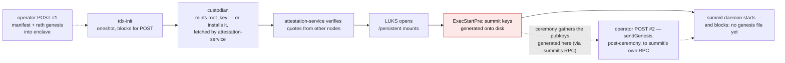
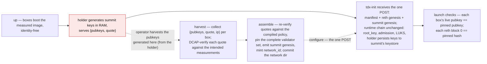

# Founding reorder (decision record)

> **Decision record — July 2026.** A point-in-time capture of the design pass
> that reordered network founding. It describes the boot chain and the
> alternatives as they stood when the decision was made, and is not updated as
> the design moves; [network-founding.md](../network-founding.md) is the
> authority on how founding runs today.
>
> **Extended** by [the root-key commitment record](2026-09-root-key-commitment.md#mint-first)
> (September 2026), which applies the same move to `root_key`.

**Outcome: summit's validator keys are born before the manifest, so
`network_id` pins the complete founding validator set.** Boxes boot the
measured image identity-free, a new key-holder service generates summit
keypairs in RAM and proves them with a TDX quote, and the deploy tool verifies
the quotes and pins every validator's pubkeys and withdrawal address before
minting `network_id`. The genesis ceremony and its injection machinery are
deleted. Founding becomes a more fragile, supervised operation, but founding
happens rarely, while joining and verifying happen forever, and those check
exactly one hash.

- [The boot chain at the time](#the-boot-chain-at-the-time)
- [The problem](#the-problem)
- [The reorder](#the-reorder)
- [Alternatives considered](#alternatives-considered)
- [The condensed decision](#the-condensed-decision)
- [Implementation surface](#implementation-surface)

Side by side with the fallback design — the same boot chain in both, one event
moves, everything else is consequence:

## The boot chain at the time

Two facts shaped the design.

**The manifest must predate every node.** Nodes bind `network_id` into their
attestation transcripts from first boot (it is what prevents "right image,
wrong network" replay), so the manifest — and therefore everything it pins —
must be final before any node is configured.

**The boot chain was config-gated, and summit's keys came last.** Every
service on a node started only after the operator POSTed the node's
configuration, which carried the manifest:

Summit's validator keys (ed25519 node identity + BLS consensus key) were
generated by the summit unit's pre-start step
(`ExecStartPre=summit keys generate -n`, writing into the LUKS-backed
keystore; the daemon itself only read keys) — the last link of a chain whose
first link required the manifest. Keys after identity, by construction.

Note the **second operator POST**. The config POST could not carry the summit
genesis (at founding, the validator set did not exist yet — that was the whole
problem), so the summit daemon started, found no genesis file, and blocked on
its own provisioning RPC until the ceremony delivered one via `sendGenesis`.
This was not a founders-only quirk: the config POST had no summit-genesis
field at all, so **every fresh node — late joiners included, for whom the
genesis had existed for ages — needed the second delivery**. Only reboots
skipped it, because the file persisted on the LUKS volume.

## The problem

- The founding summit genesis — validator set included — is needed verbatim by
  **every future joiner**: summit loads the full genesis unconditionally, and
  checkpoint verification anchors on the genesis committee (checkpoints layer
  on top of genesis; they don't replace it).
- Because the keys post-dated the manifest, that file structurally could not be
  hash-pinned by `network_id`. Committing it anyway creates a second, unpinned
  trust stratum: verifying it means field-by-field comparison against the
  pinned template, and even an attested quote sidecar only ever proves
  *membership* validity, never set *completeness* — and must be re-verified
  against aging Intel collateral by every future reader.
- A pile of machinery existed solely to inject the late-born facts into the
  already-founded identity: the `validators = []` template fill, summit's
  offline `genesis` binary, the `sendGenesis` pre-genesis RPC and its wait
  path (localhost-bound by design, yet reachable through the node's public
  `/summit` proxy), and the genesis-ceremony CLI.

## The reorder

Reorder founding so the keys exist first:

The joiner flow collapses to: verify `sha256(manifest) == network_id`, verify
each artifact against the manifest (now covering the summit genesis's full
consensus content — parameters plus every validator's keys and withdrawal
credentials), then `up` + `configure`; runtime admission and the deposit
contract do the rest.

Properties bought:

- **One-hash identity.** `network_id` pins everything, founding-set
  completeness included. No unpinned artifact, no quote sidecar, no
  re-verification of aging collateral: the verification result is *committed
  into the pin* at assemble time, instead of left as re-checkable evidence —
  structurally impossible in any design where keys post-date the manifest.
  A small bonus: the manifest's clone-deployment uniquifier nonce retires —
  no two foundings can produce the same manifest, because each pins its own
  freshly harvested keys.
- **Ceremony deleted.** Its only reason to exist was injecting late-born facts.
  With early-born keys, the gather folds into assemble's inputs, delivery
  folds into configure, and the readiness barrier folds into launch checks.
- **One atomic config delivery.** Every fresh node needed *two* operator
  POSTs: the tdx-init config, then — after summit started and blocked waiting
  — a `sendGenesis` to summit's own RPC. The single config POST carries
  manifest + reth genesis + summit genesis; tdx-init fans them out and every
  binary finds its inputs on disk before it starts.
- **Uniform node lifecycle.** "Founding node" stops being a node-side concept:
  every box boots identity-free, holds RAM keys, persists them at LUKS-open.
  Founders differ only in being harvested before assemble.

The boot chain is otherwise unchanged: key generation moves from the post-LUKS
`ExecStartPre` into a pre-POST holder, with a persist step where the keygen
used to be, and the second POST disappears. Where the holder lives, how it
guards its keys, and what the manifest pins of the summit genesis were settled
in the same pass; they are part of the current design, in
[network-founding.md](../network-founding.md) and its
[design rationale](../network-founding.md#design-rationale).

## Alternatives considered

- **Ceremony + split** (keep late-born keys; split the summit genesis into a
  pinned params file and a separately-committed validators file, delivered by
  a `sendValidators` RPC, with an attested pubkey-quote sidecar): the cheaper
  transition — the boot chain stays frozen — and the documented fallback if
  the holder is judged unacceptable. Rejected as an end-state: the sidecar
  proves membership but never completeness, ages with Intel collateral, and
  the network dir permanently carries a second trust stratum plus the
  injection machinery.
- **Commit the merged founding genesis.toml as-is**: partial pinning — every
  field except the validator set is covered by the template hash, and nothing
  marks which is which.
- **Operator-side keygen** (deploy generates the founding keypairs, pins
  them, injects them post-LUKS): deletes the holder, the boot-chain work, and
  the fragility window entirely — the strongest-looking simplification,
  rejected for a structural reason. Consensus signatures are verified
  *offline* (checkpoints, weak-subjectivity joiners) with no channel context,
  so founding keys that ever existed outside a TEE let the operator forge
  alternative signed histories for every future verifier, forever. Per-message
  or per-session TEE quotes cannot patch this: a quote binds the *endpoint*
  to a TEE, not the key — whoever holds the key signs out-of-band regardless —
  and quote generation is seconds of exclusive machine-wide TPM access, so
  per-request quoting degrades to attested channel establishment, which is
  admission, which already exists. "This signature exists ⇒ a TEE produced
  it" holds only if the key never exists outside a TEE.
- **TPM-sealed pre-identity keys**: see the founding doc's
  [design rationale](../network-founding.md#design-rationale).
- **Single-node founding** (bootstrap with N=1; everyone else joins via
  deposits): doesn't remove the machinery — the one key must still predate
  `network_id`, so the holder, harvest, and verification all remain at N=1 —
  and adds three problems: `root_key` is RAM-only on every node, so an N=1
  network dies permanently on its first reboot until a second node holds it;
  genesis-era checkpoints would anchor on a committee of one key forever; and
  it puts the deposit-join path on the founding critical path before that
  path exists.
- **Hosting the holder in the custodian or attestation-service**: see the
  founding doc's [design rationale](../network-founding.md#design-rationale).
- **Genesis-less joining via checkpoints**: complementary (weak subjectivity
  remains the late-joiner anchor), not a substitute — the genesis also
  supplies parameters and the signing namespace, and from-genesis
  verifiability still needs the founding set preserved.

## The condensed decision

One-hash identity + a uniform node lifecycle + deleted ceremony machinery,
versus a more forgiving founding operation. Founding is a rare, supervised,
internal act; joining and verifying are the forever-repeated public acts —
optimize for the joiner side.

## Implementation surface

As planned at decision time. Four repos, with two hard ordering constraints:
summit's `genesis digest` subcommand (with the digest hardening) must exist
before deploy can pin, and the enclave repo's manifest-schema change must merge
before deploy's, whose tests pin the enclave fixture bytes cross-repo.
Otherwise, roughly in dependency order:

1. **enclave** — the `summit-key-holder` binary; the new harvest-quote
   binding; the `summit_genesis_base64` tdx-init field; a CLI wrapper over
   the existing in-enclave DCAP verification for deploy to shell out to.
2. **seismic-images** — the holder unit; summit.service edits (replace the
   keygen ExecStartPre with the persist client; point the genesis path at
   the POSTed file); TPM group membership.
3. **deploy** — harvest command (archiving quotes *and* the DCAP collateral
   current at harvest, so founding TEE-ness stays auditable later);
   quote verification in assemble; genesis emission and `config_digest`
   pinning; launch assertions; founding-window network restrictions;
   ceremony deletion.
4. **summit** — first, the additive `genesis digest` subcommand and the
   digest hardening (prerequisites); then cleanup that can ride any time
   after: delete the pre-genesis RPC and wait path, and retire the offline
   `genesis` binary (the ceremony is its only caller).
