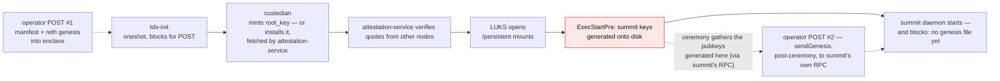
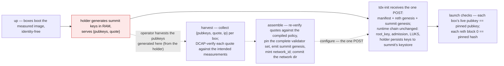
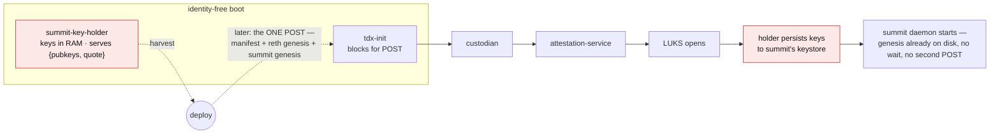
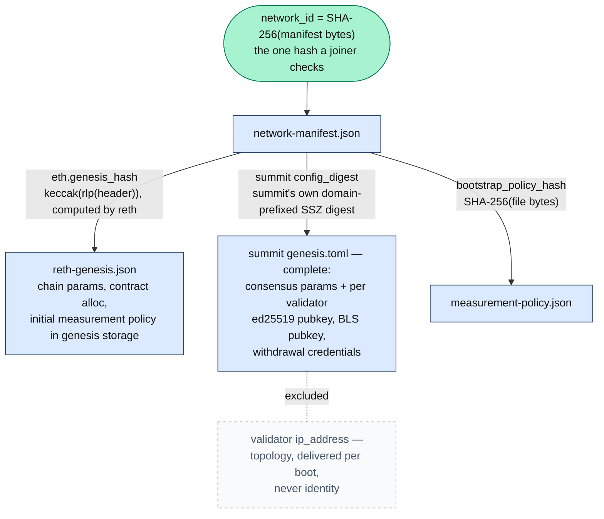

# Network Founding — Boot-Chain Sequencing

**Status**: agreed design (2026-07); implementation in progress — the
enclave surface (item 1 under Implementation surface) is fully merged
as of 2026-08 (enclave #229–#232).

How a Seismic network is founded: where validator keys are born, what the
network's identity hash covers, and how the node boot chain is sequenced to
make that possible. Written for reviewers of the enclave/images changes and
for future engineers wondering why founding works this way.

## Summary

A network's identity is one hash: `network_id = SHA-256(network-manifest.json)`,
where the manifest pins every founding artifact (reth genesis, summit genesis,
measurement policy). For that hash to cover the founding *validator set*, the
validators' keys must exist before the manifest is assembled — but in the
current boot chain, summit keys are generated at the very end
(admission → root_key → LUKS → keygen), long after `network_id` must exist.

This design reorders founding so the keys are born first. Boxes boot the
measured image **identity-free**; a small **key-holder** service generates
summit keypairs in RAM and proves them with a TDX quote; the deploy tool
verifies the quotes and pins the complete validator set — per validator:
both pubkeys and the withdrawal address, never the IP (see "What the
manifest pins") — before minting `network_id`; the genesis-ceremony
machinery is deleted. Founding becomes a
more fragile, supervised operation — but founding happens rarely, while
joining and verifying happen forever, and those now check exactly one hash.

Side by side with the design it replaces — the same boot chain in both,
one event moves, everything else is consequence:


## Background

Two facts shape the design:

**The manifest must predate every node.** Nodes bind `network_id` into their
attestation transcripts from first boot (it is what prevents "right image,
wrong network" replay), so the manifest — and therefore everything it pins —
must be final before any node is configured.

**The boot chain is config-gated.** Every service on a node starts only after
the operator POSTs the node's configuration (which carries the manifest):



Summit's validator keys (ed25519 node identity + BLS consensus key) are today
generated by the summit unit's pre-start step
(`ExecStartPre=summit keys generate -n`, writing into the LUKS-backed
keystore; the daemon itself only reads keys) — the last link of a chain whose
first link requires the manifest. Keys after identity, by construction.

Note the **second operator POST**. The config POST cannot carry the summit
genesis (at founding, the validator set doesn't exist yet — that's the whole
problem), so the summit daemon starts, finds no genesis file, and blocks on
its own provisioning RPC until the ceremony delivers one via `sendGenesis`.
And this is not a founders-only quirk: today's config POST has no
summit-genesis field at all, so **every fresh node — late joiners included,
for whom the genesis has existed for ages — needs the second delivery**.
Only reboots skip it, because the file persists on the LUKS volume.

## Problem

- The founding summit genesis — validator set included — is needed verbatim by
  **every future joiner**: summit loads the full genesis unconditionally, and
  checkpoint verification anchors on the genesis committee (checkpoints layer
  on top of genesis; they don't replace it).
- Because the keys post-date the manifest, that file structurally cannot be
  hash-pinned by `network_id`. Committing it anyway creates a second, unpinned
  trust stratum: verifying it means field-by-field comparison against the
  pinned template, and even an attested quote sidecar only ever proves
  *membership* validity, never set *completeness* — and must be re-verified
  against aging Intel collateral by every future reader.
- A pile of machinery exists solely to inject the late-born facts into the
  already-founded identity: the `validators = []` template fill, summit's
  offline `genesis` binary, the `sendGenesis` pre-genesis RPC and its wait
  path (localhost-bound by design, yet reachable today through the node's
  public `/summit` proxy), and the genesis-ceremony CLI.

## Design

Reorder founding so the keys exist first:



The joiner flow collapses to: verify `sha256(manifest) == network_id`, verify
each artifact against the manifest (now covering the summit genesis's full
consensus content — parameters plus every validator's keys and withdrawal
credentials), then `up` + `configure`; runtime admission and the deposit
contract do the rest.

Properties bought:

- **One-hash identity.** `network_id` pins everything, founding-set
  completeness included. No unpinned artifact, no quote sidecar, no
  re-verification of aging collateral: the verification result is *committed
  into the pin* at assemble time, instead of left as re-checkable evidence —
  structurally impossible in any design where keys post-date the manifest.
  A small bonus: the manifest's clone-deployment uniquifier nonce retires —
  no two foundings can produce the same manifest, because each pins its own
  freshly harvested keys.
- **Ceremony deleted.** Its only reason to exist was injecting late-born facts.
  With early-born keys, the gather folds into assemble's inputs, delivery
  folds into configure, and the readiness barrier folds into launch checks.
- **One atomic config delivery.** Today every fresh node needs *two* operator
  POSTs: the tdx-init config, then — after summit starts and blocks waiting —
  a `sendGenesis` to summit's own RPC (late joiners too; the config POST has
  no summit-genesis field). Now the single config POST carries manifest +
  reth genesis + summit genesis; tdx-init fans them out and every binary
  finds its inputs on disk before it starts.
- **Uniform node lifecycle.** "Founding node" stops being a node-side concept:
  every box boots identity-free, holds RAM keys, persists them at LUKS-open.
  Founders differ only in being harvested before assemble. (The `genesis_node`
  role — which box mints `root_key` — remains, and is orthogonal.)

## Why founding-time quote verification is load-bearing

Two independent gates protect two different things:

- **root_key admission** (attestation-service verifies evidence
  enclave-to-enclave before the custodian wraps `root_key`) gates the
  *privacy* trust: decryption keys, LUKS. Unchanged by this design.
- **Consensus membership** is gated by whose pubkeys are in the validator
  set. Summit never talks to the custodian — its keys are per-validator, not
  network-shared — so an unverified founding pubkey could vote from outside a
  TEE. Post-genesis validators get TEE-ness enforced on the way in by
  deposit/registry admission; founding keys bypass that path by construction.
  Assemble-time DCAP verification is the founding analogue of contract
  admission: the same check, done once, by the tool that pins the set.

The harvest quote is also a stronger statement than a BLS proof-of-possession:
measured code generated the keypair and quoted pubkeys derived from private
keys it holds, so possession, TEE custody, and honest generation (no rogue-key
choice) all follow from the measurement. Post-genesis joiners still provide
signature-based possession proofs through the deposit path.

## The key holder

The reorder needs a component that: generates summit keypairs in RAM at boot,
before any configuration exists; serves `{pubkeys, quote}`; persists to
summit's keystore once LUKS opens; and zeroizes its RAM copies. None of the
existing processes can host it:

- **tdx-init** is a oneshot that blocks for the config POST — no process
  lifetime to hold RAM keys.
- **The custodian** starts only after the POST, and hosting the holder there
  would invert its design: the custodian is deliberately the most isolated
  process on the box (no network listener ever, no async runtime, unix socket
  only, pre-verified authorization in — never raw evidence), while the holder
  must serve HTTP to the outside world pre-manifest, pre-admission — the most
  exposed moment in the node's life — and would drag a BLS dependency into
  the process that owns `root_key`. Its custody model also doesn't fit:
  the custodian guards one network-shared secret and keys derived from it;
  summit keys are independent per-VM randomness with a different consumer
  and lifecycle.
- **attestation-service** is gated behind the POST four ways (a hard unit
  dependency on tdx-init, a required environment file the POST produces, a
  fatal manifest load at startup, and it binds its port only once root_key
  is in hand — the very bound-port-is-the-readiness-signal contract deploy
  tooling relies on, which breaks if the service ever serves earlier).
  Restructuring all of that is strictly worse than one new unit.

Hence a new unit, `summit-key-holder.service`:



The boot chain is otherwise **identical** to today's — compare with the
Background diagram: the red nodes are the only change (key generation moves
from the post-LUKS `ExecStartPre` into the pre-POST holder, with a persist
step where the keygen used to be), and the second POST disappears. Because
the config POST now carries all three artifacts atomically, tdx-init fans
everything out and every binary simply finds its inputs on disk — founders
and late joiners alike, with no post-hoc delivery to a live, waiting summit.

- **Starts pre-POST**, parallel to tdx-init's wait (`After=network-online`);
  depends on nothing the POST produces. Network is needed only for quote
  generation (Azure IMDS).
- **Runs as the summit user** (plus TPM device-group membership). This keeps
  the custody rule intact by construction — summit's keys are still persisted
  under summit's own user and ownership into `/persistent/summit/keys`;
  keygen just moves to a different binary running as the same user. No shared
  group on private keys; serving pubkeys never grants another user read
  access to key material.
- **Serves plain HTTP on its own port** (nginx and TLS certificates exist
  only post-POST; deploy tooling already polls raw ports during first boot).
  The quote's `report_data` is a domain-separated binding over a
  deploy-supplied fresh nonce plus both pubkeys — the nonce prevents replay
  of quotes from earlier harvests. (The binding cannot include `network_id`:
  it doesn't exist yet. The pin itself provides the intent binding; see
  "Founding-window security" for what that costs.)
- **Stops serving quotes once the manifest file appears**: the Azure vTPM
  quote path is exclusive-open and serialized machine-wide (seconds per
  call), and attestation-service owns it from the POST onward. Per boot,
  not permanently — the config lives on tmpfs and is re-POSTed each boot,
  so a rebooted node briefly serves quotes over fresh RAM keys that the
  persist check then discards. Harmless (nothing ever signs with them),
  but it makes the holder port's network restriction permanent rather
  than founding-only. Pubkey serving continues for life — post-LUKS it
  reads the keystore and becomes the source for the launch-time
  continuity check.
- **Persist trigger**: summit.service's current
  `ExecStartPre=summit keys generate -n` line is *replaced* by a persist
  client that blocks until the holder has written the keystore (first boot)
  or confirmed it already exists (reboot; RAM keys discarded). The old keygen
  line must not survive as a fallback — its don't-overwrite semantics racing
  the holder would silently mint fresh, unpinned keys and defer the failure
  from a loud startup error to a launch-check mismatch. The existing systemd
  ordering (LUKS setup before summit) already brackets the persist; no new
  notification channel is needed.

**Single process now, split later if warranted.** The single-process holder's
one weakness is that private consensus keys live in the same process that
serves HTTP at the node's most exposed moment. The founding-window guards
below narrow this (only a fully *silent* exploit that survives the configure
and launch checks cashes out), so v1 ships as one process. The documented
upgrade replicates the custodian-split pattern *within* the holder: a custody
process (privates in RAM, local unix socket only, writes the keystore at
persist) plus a secret-free HTTP front that fetches pubkeys over the socket
and mints the harvest quote. That buys "privates never live in the
network-facing process" without touching the real custodian. The v1 code
keeps keygen/persist and serving as separable modules so the split stays
mechanical.

Placement details: the holder binary lives in the enclave repo, linking
`commonware-cryptography` from crates.io (matching summit's key types); the
keystore wire format — hex-encoded keys in `node_key.pem` /
`consensus_key.pem` — is pinned by a golden-vector test against summit's
[`keys generate`](https://github.com/SeismicSystems/summit/blob/main/node/src/keys.rs).
Delivering the summit genesis rides the same change set: tdx-init's POST
schema gains a `summit_genesis_base64` field fanned out to
`/run/seismic/conf/`, and summit reads it from there — the same
re-POSTed-per-boot lifecycle as the reth genesis, using summit's existing
load-genesis-from-file path
([`acquire_genesis`](https://github.com/SeismicSystems/summit/blob/main/node/src/args.rs)
returns immediately when a valid file is present, so the pre-genesis RPC is
dead code from day one).

## Key custody: RAM-only, no TPM sealing

Founding keys live in the holder's RAM (TDX-protected) until LUKS opens.
Accepted risk: a reboot or box loss in the harvest → LUKS-open window
destroys a pinned key, forcing a **re-found** — operationally, destroy the
stacks and start over (`down` + fresh `up`). Destroying the stacks deletes
the data disks, which is the LUKS wipe; fresh boxes mean fresh IPs and a
fresh harvest, so nothing stale can leak into the new identity. Nothing of
value exists pre-genesis; founding is a rare, short, supervised internal act.

The must-build guard is the **launch-time pubkey-continuity assertion**: a
rebooted box regenerates fresh RAM keys and passes admission fine, so without
the check the network launches with a silent dead founding slot. (Response
policy can be graded — BFT tolerates f dead of 3f+1 and the deposit path can
eventually replace a slot, so a devnet may accept a degraded launch where
mainnet re-founds.)

TPM-sealed key durability was considered and rejected unless RAM-only proves
unacceptable for mainnet founding: it adds a second sealing policy that must
stay in lockstep with the measurement policy, unknown vTPM clone/rollback
semantics (a duplicated consensus key is accidental equivocation), and
sealed-blob migration and scrubbing machinery.

## Founding-window security

The identity-free window is an attack surface, not just an availability risk:
tdx-init accepts the *first* config POST, and a waiting box holds pinnable
key material. An attacker who POSTs first enrolls the box into *their*
network — their manifest, their measurement policy, their responders — and
can deliver a `root_key` they know, after which the holder would persist the
harvested keys onto a LUKS volume the attacker can read. The failure is
bounded — tdx-init is one-shot, so the real configure then fails loudly and a
re-found discards those pubkeys before anything launches — but only if the
process treats it that way. Guards:

- **Network-level**: restrict the config port and the holder port to the
  operator's source CIDR for the founding window.
- **Burned-key rule**: a harvested key is trustworthy only if the same box
  later accepts the real configure cleanly. Any anomaly — already configured,
  POST rejected, unexpected reboot — burns the whole harvest: re-found, never
  retry-around.
- The rootfs is measured at boot but not (yet) integrity-protected at
  runtime, so a harvest quote attests boot-time state only. Window length is
  a security parameter: keep founding short and supervised — noting its
  floor: first-boot disk provisioning (encryption plus integrity setup) can
  run an hour-plus on multi-TB disks, and a re-found repeats it.

## What the manifest pins: summit's `config_digest`

The manifest's summit-genesis field pins summit's own `config_digest`: the
SHA-256 over summit's domain-prefixed SSZ serialization of the genesis. That
covers all consensus parameters and, per validator, the ed25519 node pubkey,
the BLS consensus pubkey, and the withdrawal credentials — and deliberately
**excludes IPs**, exactly as summit's own code does (the `ip_address` field
is annotated "network topology, not consensus identity" and skipped from the
digest). IPs are still collected at harvest and delivered via configure —
peers have to be wired somewhere — but they are operational data, never
identity: a wrong IP is a liveness problem only, since peers authenticate
each other by the pinned ed25519 keys.

The full commitment graph — everything a joiner's one hash covers:



In file form — per line: is it covered by **(a)** today's pinned template
hash, and **(b)** this design's `config_digest`?

```toml
# abridged founding genesis.toml
eth_genesis_hash  = "0x78ab9057…"      # (a) yes   (b) yes
leader_timeout_ms = 2000               # (a) yes   (b) yes
namespace         = "_SUMMIT"          # (a) yes   (b) yes
validator_minimum_stake = 32000000000  # (a) yes   (b) yes
# …remaining consensus params: same story…

# Today the pinned artifact is the *template*, which ENDS here with a
# `validators = []` placeholder. Everything below is injected by the
# post-manifest ceremony — covered by nothing today.

[[validators]]
node_public_key        = "1be3cb06…"                                   # (a) no   (b) YES
consensus_public_key   = "a6f61154…"                                   # (a) no   (b) YES
withdrawal_credentials = "0xf39Fd6e51aad88F6F4ce6aB8827279cffFb92266"  # (a) no   (b) YES
ip_address             = "20.85.237.59:18551"                          # (a) no   (b) no — topology, never identity

# …one [[validators]] entry per founder…
```

The digest is computed by shelling out to a small additive
`summit genesis digest <file>` subcommand, exactly parallel to how the
manifest's reth field uses `seismic-reth genesis-hash`. This makes the
genesis file mere transport (comments and delivered-IP refreshes never
touch identity), and pins the exact value that already domain-separates
consensus: summit derives its signing and P2P domain from `config_digest`,
so a node running a divergent genesis cannot even complete handshakes —
byte-exactness would add nothing on top.

One sharp edge, found in code review: the digest hashes each key field as
its hex *string* and the validator list in file order — summit parses
`0x`-prefixed and bare hex alike but digests them differently, and nothing
enforces the sorted order summit's own tooling emits. The planned
hardening is for summit to digest decoded key bytes and reject unsorted
validator lists (a domain-tag bump — free before any digest is pinned, a
fork after); until it lands, deploy emits exactly the canonical form
summit's tools produce, and configure's IP-splice never re-serializes any
other field.

**Making the mutability visible in the artifact itself.** An operator
fetching this file can't tell from TOML alone that `ip_address` is safe to
update while every other line is identity. Three answers, in increasing
order of structure:

- Because the pin covers parsed content, not bytes, the committed file can
  carry **comments** — deploy emits it self-documenting (a header stating
  digest coverage; a `# topology — safe to update, not identity` marker on
  every `ip_address` line). The file-bytes pin would have made this
  impossible: a comment would change the network's identity.
- Operators shouldn't hand-edit IPs anyway: **configure splices current
  IPs** into the genesis it POSTs each boot, the same per-boot lifecycle as
  reth bootnodes. The committed file is a founding-era snapshot; any
  IP-updated variant verifies, because the digest ignores IPs.
- The end state is **topology out of the genesis file entirely**: summit
  already *replaces* committee IPs with its `--bootstrappers` input for
  ingress when one is provided (genesis IPs then only feed a node's own
  advertised address), and a late joiner's own key isn't in the
  genesis at all — genesis IPs only ever matter for founders at t=0. Making
  `ip_address` optional and delivering peer addresses as per-boot config
  (tdx-init env/flag injection, as reth's bootnodes already work) is a
  small summit schema change, tracked as
  [summit#447](https://github.com/SeismicSystems/summit/issues/447)
  rather than part of this design.

The rejected candidate was hashing the file bytes (`sha256(genesis.toml)`):
verification is `sha256sum`, but every byte becomes identity — including
each validator's `ip_address` — and deploy becomes the sole emitter of
byte-canonical TOML forever. An IP change during founding would force a
re-found; a founder's IP change after launch would leave the pinned file
permanently stale. The usual argument for raw-byte hashing (avoiding a
canonicalization that multiple languages must implement identically) does
not apply here: `config_digest` has exactly one implementation — summit's —
consumed by shell-out.

Not pinning the summit genesis at all is not an option: the domain
separation makes *live nodes* agree with each other, but only the pin lets a
joiner verify the founding set is the right, complete one before trusting
checkpoints.

**The Ethereum comparison.** Ethereum separates these tiers architecturally:
consensus-critical parameters live in the chainspec / beacon preset (and the
beacon chain, like this design, has genesis validators inside its pinned
genesis state root, with signature domains derived from
`(fork_version, genesis_validators_root)` — the same move as
`chain_domain = f(config_digest)`); node-local tuning (timeouts, peer
limits, message sizes) never enters the spec at all — it's client flags,
freely different per node. Summit currently welds both tiers into one hashed
genesis file, so its liveness knobs (`leader_timeout_ms`,
`max_message_size_bytes`, …) are network identity: retuning one is a new
domain, effectively a new network. (Most *numeric consensus* params — stake
bounds, epoch length, deposit/withdrawal caps — are a third tier: already
chain-governed via `ProtocolParams.sol`, with genesis pinning only their
initial values, the same pinned-bootstrap/governed-live layering as the
measurement policy. The truly frozen fields are precisely the tuning
knobs.) If summit ever adopts the Ethereum-shaped
split — knobs out of genesis into per-boot config, the same mechanism as the
topology follow-up — the manifest's coverage tracks it automatically,
because it pins summit's own digest rather than defining its own.

## Alternatives considered

- **Ceremony + split** (keep late-born keys; split the summit genesis into a
  pinned params file and a separately-committed validators file, delivered by
  a `sendValidators` RPC, with an attested pubkey-quote sidecar): the cheaper
  transition — the boot chain stays frozen — and the documented fallback if
  the holder is judged unacceptable. Rejected as an end-state: the sidecar
  proves membership but never completeness, ages with Intel collateral, and
  the network dir permanently carries a second trust stratum plus the
  injection machinery.
- **Commit the merged founding genesis.toml as-is**: partial pinning — every
  field except the validator set is covered by the template hash, and nothing
  marks which is which.
- **Operator-side keygen** (deploy generates the founding keypairs, pins
  them, injects them post-LUKS): deletes the holder, the boot-chain work, and
  the fragility window entirely — the strongest-looking simplification,
  rejected for a structural reason. Consensus signatures are verified
  *offline* (checkpoints, weak-subjectivity joiners) with no channel context,
  so founding keys that ever existed outside a TEE let the operator forge
  alternative signed histories for every future verifier, forever. Per-message
  or per-session TEE quotes cannot patch this: a quote binds the *endpoint*
  to a TEE, not the key — whoever holds the key signs out-of-band regardless —
  and quote generation is seconds of exclusive machine-wide TPM access, so
  per-request quoting degrades to attested channel establishment, which is
  admission, which already exists. "This signature exists ⇒ a TEE produced
  it" holds only if the key never exists outside a TEE.
- **TPM-sealed pre-identity keys**: see "Key custody" above.
- **Single-node founding** (bootstrap with N=1; everyone else joins via
  deposits): doesn't remove the machinery — the one key must still predate
  `network_id`, so the holder, harvest, and verification all remain at N=1 —
  and adds three problems: `root_key` is RAM-only on every node, so an N=1
  network dies permanently on its first reboot until a second node holds it;
  genesis-era checkpoints would anchor on a committee of one key forever; and
  it puts the deposit-join path on the founding critical path before that
  path exists.
- **Hosting the holder in the custodian or attestation-service**: see "The
  key holder" above.
- **Genesis-less joining via checkpoints**: complementary (weak subjectivity
  remains the late-joiner anchor), not a substitute — the genesis also
  supplies parameters and the signing namespace, and from-genesis
  verifiability still needs the founding set preserved.

## The condensed decision

One-hash identity + a uniform node lifecycle + deleted ceremony machinery,
versus a more forgiving founding operation. Founding is a rare, supervised,
internal act; joining and verifying are the forever-repeated public acts —
optimize for the joiner side.

## Implementation surface

Four repos. Two hard ordering constraints: summit's `genesis digest`
subcommand (with the digest hardening above) must exist before deploy can
pin, and the enclave repo's manifest-schema change must merge before
deploy's, whose tests pin the enclave fixture bytes cross-repo. Otherwise,
roughly in dependency order:

1. **enclave** — the `summit-key-holder` binary; the new harvest-quote
   binding; the `summit_genesis_base64` tdx-init field; a CLI wrapper over
   the existing in-enclave DCAP verification for deploy to shell out to.
2. **seismic-images** — the holder unit; summit.service edits (replace the
   keygen ExecStartPre with the persist client; point the genesis path at
   the POSTed file); TPM group membership.
3. **deploy** — harvest command (archiving quotes *and* the DCAP collateral
   current at harvest, so founding TEE-ness stays auditable later);
   quote verification in assemble; genesis emission and `config_digest`
   pinning; launch assertions; founding-window network restrictions;
   ceremony deletion.
4. **summit** — first, the additive `genesis digest` subcommand and the
   digest hardening (prerequisites, above); then, cleanup that can ride
   any time after: delete the pre-genesis RPC and wait path, and retire
   the offline `genesis` binary (the ceremony is its only caller).
