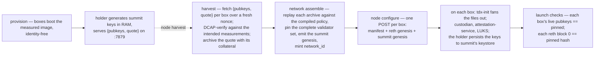
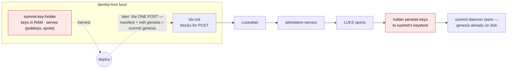
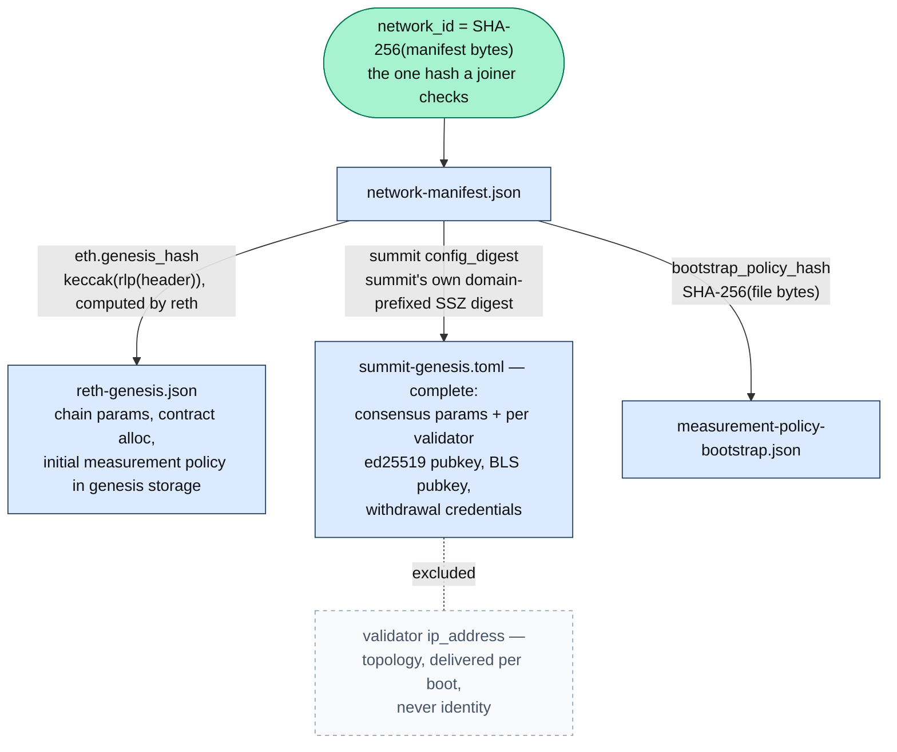

# Network Founding <!-- omit in toc -->

**Status**: shipped. The key holder, the one config POST per box, and the
harvest → assemble → configure flow are how the four-node devnet was founded.
The `tx_io_pk@0` pin is decided, not yet built; today a flag in the config
POST picks the box that mints `root_key`, and the sections below say where
that differs.

How a Seismic network is founded: where validator keys are born, what the
network's identity hash covers, and how the node boot chain is
sequenced to allow it. The byte-exact manifest rules belong to
[the network manifest](network-manifest.md); the holder's wire format and
quote binding belong to its code in the
[enclave](https://github.com/SeismicSystems/enclave/tree/seismic/bin/summit-key-holder)
repo.

- [Summary](#summary)
- [The founding flow](#the-founding-flow)
- [Why founding-time quote verification is load-bearing](#why-founding-time-quote-verification-is-load-bearing)
- [The key holder](#the-key-holder)
- [Key custody: RAM-only, no TPM sealing](#key-custody-ram-only-no-tpm-sealing)
- [Founding-window security](#founding-window-security)
- [What the manifest pins: summit's `config_digest`](#what-the-manifest-pins-summits-config_digest)
- [Design rationale](#design-rationale)

## Summary

A network's identity is one hash: `network_id = SHA-256(network-manifest.json)`,
where the manifest pins every founding artifact: the reth genesis, the summit
genesis, and the bootstrap measurement policy. The manifest pins the summit
genesis, and that genesis carries the complete founding validator set, so the
validators' keys must exist before the manifest does
([design rationale](#design-rationale)).

Boxes boot the measured image **identity-free**. A small **key-holder**
service generates summit keypairs in RAM and proves them with a TDX quote.
The founder harvests and DCAP-verifies those quotes, and assemble pins the
complete validator set before minting `network_id`. Per validator, the pin
covers both pubkeys and the withdrawal address, never the IP
([what the manifest pins](#what-the-manifest-pins-summits-config_digest)).
Configure then delivers everything a node needs in one POST.

Founding is a fragile, supervised operation. It happens rarely, while joining
and verifying happen forever, and those check exactly one hash.

## The founding flow


```mermaid
flowchart LR
    U["provision — boxes boot the measured image,<br/>identity-free"] --> K
    K["holder generates summit keys in RAM,<br/>serves {pubkeys, quote} on :7879"]
    K -. "node harvest" .-> H
    H["harvest — fetch {pubkeys, quote} per box over a fresh nonce;<br/>DCAP-verify against the intended measurements;<br/>archive the quote with its collateral"] --> A
    A["network assemble — replay each archive against the compiled policy,<br/>pin the complete validator set, emit the summit genesis,<br/>mint network_id"] --> C
    C["node configure — one POST per box:<br/>manifest + reth genesis + summit genesis"] --> T
    T["on each box: tdx-init fans the files out;<br/>custodian, attestation-service, LUKS;<br/>the holder persists the keys to summit's keystore"] --> LC
    LC["launch checks — each box's live pubkeys == pinned;<br/>each reth block 0 == pinned hash"]
```

Each step is one command, run by the founder:

1. **Provision.** The cohort's Pulumi stack in the
   [deploy](https://github.com/SeismicSystems/deploy) repo (`pulumi up`) boots
   every box on the measured image. No box holds any network identity yet.
2. **Harvest** (`seismic-tee node harvest`). For each box, fetch the holder's
   pubkeys and a TDX quote over a fresh per-box nonce, DCAP-verify the quote
   against the network's intended measurements, and archive the result under
   the network directory's `inputs/harvest/`. The archive holds the DCAP
   collateral the verification used, so the quote stays verifiable after
   Intel's live collateral moves on.
3. **Assemble** (`seismic-tee network assemble`). Replay every archived quote
   offline against the policy compiled from the authored measurements. Have
   summit emit the validator list into the summit genesis, pin summit's
   `config_digest` of it, and write the manifest. `network_id` is the SHA-256
   of the manifest bytes. The validators' IPs come from the cohort's node
   descriptors, not from the harvest.
4. **Configure** (`seismic-tee node configure --genesis-node <name>`). POST
   each box its configuration: the manifest, the reth genesis, and the summit
   genesis with each box's current IP spliced in. The genesis node goes first,
   since its reth enode is the joiners' bootnode, and the joiners follow.
   Each node is deploy-verified as soon as it is ready.
5. **Launch checks**, at the end of configure and again on demand with
   `seismic-tee node configure --check`. Every box's holder must serve exactly
   the pubkeys harvested from it, and every reth must serve the manifest's
   `eth.genesis_hash` as block 0.

An auditor re-asks the founding's question later, offline, with
`seismic-tee verify-founding <dir>`: every archived quote against its archived
collateral and the pinned policy, and every archived key against the
validator set the summit genesis seats.

A joiner needs none of this. It checks `sha256(manifest) == network_id`, checks
each artifact against the manifest — which covers the summit genesis's full
consensus content, parameters plus every validator's keys and withdrawal
credentials — and then provisions a box and runs
`seismic-tee node configure --bootnode`. Runtime admission and the deposit
contract do the rest.

**Who mints `root_key` today.** `--genesis-node` marks the one box whose config
POST carries the genesis flag, and that box's custodian mints `root_key` once
the POST arrives; every other box fetches it from a peer. The decided design
mints a candidate on every box before the manifest and lets the manifest's pin
choose ([the root-key pin](network-manifest.md#the-root-key-pin)).

## Why founding-time quote verification is load-bearing

Two independent gates protect two different things:

- **root_key admission** (attestation-service verifies evidence
  enclave-to-enclave before the custodian wraps `root_key`) gates the
  *privacy* trust: decryption keys, LUKS.
- **Consensus membership** is gated by whose pubkeys are in the validator
  set. Summit never talks to the custodian — its keys are per-validator, not
  network-shared — so an unverified founding pubkey could vote from outside a
  TEE. Post-genesis validators get TEE-ness enforced on the way in by
  deposit/registry admission; founding keys bypass that path by construction.
  Founding-time DCAP verification is the founding analogue of contract
  admission: the same check, done once, by the tool that pins the set.

The harvest quote is also a stronger statement than a BLS proof-of-possession:
measured code generated the keypair and quoted pubkeys derived from private
keys it holds, so possession, TEE custody, and honest generation (no rogue-key
choice) all follow from the measurement. Post-genesis joiners still provide
signature-based possession proofs through the deposit path.

## The key holder

`summit-key-holder.service` generates summit's keypairs (ed25519 node
identity and BLS12-381 consensus key) in RAM at boot, before any
configuration exists. It serves `{pubkeys, quote}` for the harvest, persists
the keys into summit's keystore once LUKS opens, and zeroizes its RAM copies.
It is its own unit rather than part of an existing service
([design rationale](#design-rationale)).


```mermaid
flowchart LR
    subgraph boot [identity-free boot]
        direction TB
        T[tdx-init<br/>blocks for POST]
        K["summit-key-holder<br/>keys in RAM · serves {pubkeys, quote}"]
    end
    K -. harvest .-> D((deploy))
    D -. "later: the ONE POST —<br/>manifest + reth genesis + summit genesis" .-> T
    T --> C[custodian] --> A[attestation-service] --> L[LUKS opens]
    L --> PK["holder persists keys<br/>to summit's keystore"] --> S["summit daemon starts —<br/>genesis already on disk"]
    classDef holder fill:#fde8e8,stroke:#c81e1e,color:#111;
    class K,PK holder;
```

- **Starts pre-POST**, parallel to tdx-init's wait (`After=network-online`).
  It depends on nothing the POST produces. Network is needed only for quote
  generation (Azure IMDS).
- **Runs as the summit user**, plus membership of the TPM device group. This
  keeps the custody rule intact by construction: summit's keys are persisted
  under summit's own user and ownership into `/persistent/summit/keys`. No
  group is shared on private keys, and serving pubkeys never grants another
  user read access to key material.
- **Serves plain HTTP on `:7879`.** nginx and TLS certificates exist only
  after the POST, and deploy tooling already polls raw ports during first
  boot. `GET /v1/keys` returns both pubkeys; `GET /v1/quote?nonce=…` adds a
  quote whose `report_data` is a domain-separated binding over the
  deploy-supplied nonce and both pubkeys. The nonce prevents replay of quotes
  from earlier harvests. The binding cannot include `network_id`, which does
  not exist yet; the pin itself provides the intent binding, and
  [founding-window security](#founding-window-security) says what that costs.
- **Stops serving quotes once the manifest file appears**, answering
  `410 Gone`. The Azure vTPM quote path is exclusive-open and serialized
  machine-wide (seconds per call), and attestation-service owns it from the
  POST onward. This is per boot, not permanent: the config lives on tmpfs and
  is re-POSTed each boot, so a rebooted node briefly serves quotes over fresh
  RAM keys that the persist step then discards. That is harmless, since
  nothing ever signs with them, but it is why the holder port's network
  restriction is permanent rather than founding-only. Pubkey serving
  continues for life: once the keystore exists, the holder reads it, which
  makes it the source for the launch-time continuity check.
- **Persists on summit's schedule.** summit.service's pre-start step,
  `summit-key-holder persist-wait`, blocks until the holder has written the
  keystore (first boot) or confirmed it already exists (reboot, where the RAM
  keys are discarded). The unit orders it after LUKS setup, so no other
  notification channel is needed. summit.service has no keygen step of its
  own, and must never gain one as a fallback: one racing the holder would
  silently mint fresh, unpinned keys, deferring the failure from a loud
  startup error to a launch-check mismatch.

Keygen, HTTP serving, and persistence run in one process, kept as separable
modules so a later custody split stays mechanical
([design rationale](#design-rationale)). The binary lives in the enclave repo
and links `commonware-cryptography` from crates.io, matching summit's key
types. The keystore format — hex-encoded keys in `node_key.pem` and
`consensus_key.pem` — is pinned by a golden-vector test against summit's
[`keys generate`](https://github.com/SeismicSystems/summit/blob/main/node/src/keys.rs).

The summit genesis rides the config POST. tdx-init's `summit_genesis_base64`
field is written to `/run/seismic/conf/summit-genesis.toml`, and summit reads
it from there through `--genesis-path`: the same re-POSTed-per-boot lifecycle
as the reth genesis. Summit's
[`acquire_genesis`](https://github.com/SeismicSystems/summit/blob/main/node/src/args.rs)
returns immediately when a valid file is present, so summit's pre-genesis
`sendGenesis` RPC is never reached on a TEE node; deleting it is
[SEI-139](https://linear.app/seismic-systems/issue/SEI-139).

## Key custody: RAM-only, no TPM sealing

Founding keys live in the holder's RAM (TDX-protected) until LUKS opens.
A reboot or box loss in the harvest → LUKS-open window destroys a pinned key
and forces a **re-found**: destroy the stacks and start over
(`pulumi destroy` and a fresh `pulumi up`). Destroying the stacks deletes the
data disks, which is the LUKS wipe; fresh boxes mean fresh IPs and a fresh
harvest, so nothing stale can leak into the new identity. Nothing of value
exists pre-genesis, and founding is a rare, short, supervised internal act.
The keys are never sealed to the TPM ([design rationale](#design-rationale)).

The guard is the **launch-time pubkey-continuity assertion**. A rebooted box
regenerates fresh RAM keys and passes admission fine, so without the check the
network would launch with a silent dead founding slot. Configure retries a
mismatch until its deadline, because the holder serves this boot's RAM keys
until the keystore is visible; a mismatch that persists is the dead-slot case,
and the fix is a re-found, never launching around it. The response could be
graded — BFT tolerates f dead of 3f+1, and the deposit path can eventually
replace a slot — so a devnet may accept a degraded launch where mainnet
re-founds.

## Founding-window security

The identity-free window is an attack surface, not just an availability risk:
tdx-init accepts the *first* config POST, and a waiting box holds pinnable
key material. An attacker who POSTs first enrolls the box into *their*
network — their manifest, their measurement policy, their responders — and
can deliver a `root_key` they know, after which the holder would persist the
harvested keys onto a LUKS volume the attacker can read. The failure is
bounded — tdx-init is one-shot, so the real configure then fails loudly and a
re-found discards those pubkeys before anything launches — but only if the
process treats it that way. Guards:

- **Network-level**: the cloud firewall restricts the config port (`:8080`)
  and the holder port (`:7879`) to the operator's source CIDR, permanently,
  since both come back on every boot
  ([what the outside can reach](architecture.md#what-the-outside-can-reach)).
- **Burned-key rule**: a harvested key is trustworthy only if the same box
  later accepts the real configure cleanly. Any anomaly — a quote window
  already closed, a failed verification, a POST rejected, an unexpected
  reboot — burns the whole harvest: re-found, never retry-around. Harvest
  enforces its half by aborting and writing nothing. Once `root_key` is
  minted before the manifest, the rule carries more: the box whose candidate
  is pinned already holds the future `root_key`, so a first POST with a
  manifest that pins that candidate and admits the attacker's image can
  extract it. Deploy must then refuse to continue when that box's configure
  fails.
- **Window length**: the rootfs is measured at boot but not (yet)
  integrity-protected at runtime, so a harvest quote attests boot-time state
  only. Window length is a security parameter: keep founding short and
  supervised. It has a floor: first-boot disk provisioning (encryption plus
  integrity setup) can run an hour-plus on multi-TB disks, and a re-found
  repeats it.

## What the manifest pins: summit's `config_digest`

The manifest's summit-genesis field pins summit's own `config_digest`: the
SHA-256 over summit's domain-prefixed SSZ serialization of the genesis. That
covers all consensus parameters and, per validator, the ed25519 node pubkey,
the BLS consensus pubkey, and the withdrawal credentials. It deliberately
**excludes IPs**, exactly as summit's own code does: the `ip_address` field
is annotated "network topology, not consensus identity" and skipped from the
digest. Configure delivers each box's current IP in the genesis it POSTs —
peers have to be wired somewhere — but IPs are operational data, never
identity: a wrong IP is a liveness problem only, since peers authenticate
each other by the pinned ed25519 keys.

The full commitment graph — everything a joiner's one hash covers:


```mermaid
flowchart TD
    NID(["network_id = SHA-256(manifest bytes)<br/>the one hash a joiner checks"])
    NID --> M["network-manifest.json"]
    M -->|"eth.genesis_hash<br/>keccak(rlp(header)), computed by reth"| RG["reth-genesis.json<br/>chain params, contract alloc,<br/>initial measurement policy in genesis storage"]
    M -->|"summit config_digest<br/>summit's own domain-prefixed SSZ digest"| SG["summit-genesis.toml — complete:<br/>consensus params + per validator<br/>ed25519 pubkey, BLS pubkey,<br/>withdrawal credentials"]
    M -->|"bootstrap_policy_hash<br/>SHA-256(file bytes)"| MP["measurement-policy-bootstrap.json"]
    SG -.excluded.- IP["validator ip_address —<br/>topology, delivered per boot,<br/>never identity"]
    classDef pinned fill:#dbeafe,stroke:#1e3a5f,color:#111;
    classDef excluded fill:#f8fafc,stroke:#94a3b8,stroke-dasharray:4,color:#475569;
    classDef root fill:#a7f3d0,stroke:#047857,color:#111;
    class M,RG,SG,MP pinned;
    class IP excluded;
    class NID root;
```

In file form, with what the digest covers on each line:

```toml
# abridged founding summit-genesis.toml
eth_genesis_hash  = "0x78ab9057…"      # pinned
leader_timeout_ms = 2000               # pinned
namespace         = "_SUMMIT"          # pinned
validator_minimum_stake = 32000000000  # pinned
# …remaining consensus params: same story…

[[validators]]
node_public_key        = "1be3cb06…"                                   # pinned
consensus_public_key   = "a6f61154…"                                   # pinned
withdrawal_credentials = "0xf39Fd6e51aad88F6F4ce6aB8827279cffFb92266"  # pinned
ip_address             = "20.85.237.59:18551"                          # not pinned — topology, never identity

# …one [[validators]] entry per founder…
```

Assemble computes the digest by shelling out to `summit genesis digest`,
exactly parallel to how the manifest's reth field uses
`seismic-reth genesis-hash`. That makes the genesis file mere transport:
comments and delivered-IP refreshes never touch identity, and the pin is the
exact value that already domain-separates consensus. Summit derives its
signing and P2P domain from `config_digest`, so a node running a divergent
genesis cannot even complete handshakes.

**The digest is sensitive to spelling and order.** It hashes each key field as
its hex *string* and the validator list in file order: summit parses
`0x`-prefixed and bare hex alike but digests them differently, and nothing in
the digest enforces a sorted list. So the canonical form comes from summit
itself. Assemble has `summit genesis set-validators` write the validator list,
sorted by decoded node key, and configure's IP splice is a textual rewrite of
the `ip_address` lines that re-parses the result to confirm nothing else
changed. Digesting decoded key bytes and rejecting unsorted lists is
[SEI-298](https://linear.app/seismic-systems/issue/SEI-298): a domain-tag
bump, free before any permanent network pins a digest and a fork after.

**What is safe to change in the file.** Because the pin covers parsed content,
not bytes, the committed file can carry comments without changing the
network's identity. Operators never hand-edit IPs: configure splices each
box's current IP into the copy it POSTs every boot, the same per-boot
lifecycle as reth's bootnodes. The committed file is a founding-era snapshot,
and any IP-updated variant verifies, because the digest ignores IPs. Genesis
IPs only ever matter for founders at t=0: summit replaces committee IPs with
its `--bootstrappers` input for ingress when one is given, and a late
joiner's own key is not in the genesis at all. Taking topology out of the
genesis file entirely is a summit schema change,
[summit#447](https://github.com/SeismicSystems/summit/issues/447), with the
deploy follow-through in
[SEI-297](https://linear.app/seismic-systems/issue/SEI-297).

## Design rationale

Alternatives weighed and set aside, with the reasons that decided them. Each
names the section whose rule it settles.

**Keys born before the manifest, rather than a ceremony after it**
([summary](#summary)). Every future joiner needs the founding summit genesis
verbatim, validator set included, and a genesis whose keys post-date the
manifest can never be hash-pinned by `network_id`. Keeping late-born keys
leaves a second, unpinned trust stratum that a quote sidecar can prove
membership of but never completeness, plus the machinery that injects the
late facts. Generating the keys outside a TEE would delete the holder, but
consensus signatures are verified offline, so a key that ever existed outside
a TEE lets its holder forge signed histories for every future verifier. The
pass that settled this, with the boot chain it replaced and every alternative
weighed, is [the founding-reorder decision
record](decisions/2026-07-founding-reorder.md). The same move later reached
`root_key` ([the root-key commitment
record](decisions/2026-09-root-key-commitment.md#mint-first)).

**A new unit for the key holder, rather than an existing service**
([the key holder](#the-key-holder)). None of the existing processes can host
it:

- **tdx-init** is a oneshot that blocks for the config POST, so it has no
  process lifetime to hold RAM keys.
- **The custodian** would invert its own design. It is deliberately the most
  isolated process on the box: no network listener ever, no async runtime,
  unix socket only, pre-verified authorization in and never raw evidence. The
  holder must serve HTTP to the outside world pre-manifest and pre-admission,
  the most exposed moment in the node's life, and would drag a BLS dependency
  into the process that owns `root_key`. The custody models differ too: the
  custodian guards one network-shared secret and keys derived from it, while
  summit keys are independent per-VM randomness with a different consumer and
  lifecycle.
- **attestation-service** is gated behind the POST four ways: a hard unit
  dependency on tdx-init, a required environment file the POST produces, a
  fatal manifest load at startup, and a port it binds only once `root_key` is
  in hand. That last one is the bound-port-is-the-readiness-signal contract
  deploy tooling relies on, which breaks if the service ever serves earlier.
  Restructuring all of that is strictly worse than one new unit.

**One holder process, with a documented split** ([the key
holder](#the-key-holder)). The single process's one weakness is that private
consensus keys live in the process that serves HTTP at the node's most exposed
moment. The founding-window guards narrow this: only a fully *silent* exploit
that survives the configure and launch checks cashes out. The upgrade path
replicates the custodian-split pattern *within* the holder: a custody process
(privates in RAM, local unix socket only, writes the keystore at persist) plus
a secret-free HTTP front that fetches pubkeys over the socket and mints the
harvest quote. That buys "privates never live in the network-facing process"
without touching the real custodian, and the holder's control socket is
already the boundary it would split along.

**RAM-only rather than TPM-sealed founding keys** ([key
custody](#key-custody-ram-only-no-tpm-sealing)). Sealing would survive a
reboot in the window, but it adds a second sealing policy that must stay in
lockstep with the measurement policy, unknown vTPM clone and rollback
semantics (a duplicated consensus key is accidental equivocation), and
sealed-blob migration and scrubbing machinery. Sealing is not what SGX
networks use to escape this either: the host stores the sealed blob and can
serve an old one back. Revisit only if RAM-only proves unacceptable for
mainnet founding.

**Summit's `config_digest` rather than the file bytes** ([what the manifest
pins](#what-the-manifest-pins-summits-config_digest)). Hashing
`sha256(genesis.toml)` makes verification a `sha256sum`, but every byte
becomes identity — including each validator's `ip_address` — and deploy
becomes the sole emitter of byte-canonical TOML forever. An IP change during
founding would force a re-found; a founder's IP change after launch would
leave the pinned file permanently stale. The usual argument for raw-byte
hashing, avoiding a canonicalization that several languages must implement
identically, does not apply: `config_digest` has exactly one implementation,
summit's, consumed by shell-out. Not pinning the summit genesis at all is not
an option either: the domain separation makes *live nodes* agree with each
other, but only the pin lets a joiner verify the founding set is the right,
complete one before trusting checkpoints.

**Summit's tuning knobs are network identity, for now** ([what the manifest
pins](#what-the-manifest-pins-summits-config_digest)). Ethereum separates
these tiers architecturally: consensus-critical parameters live in the
chainspec and beacon preset (and the beacon chain, like summit, has genesis
validators inside its pinned genesis state root, with signature domains
derived from `(fork_version, genesis_validators_root)` — the same move as
`chain_domain = f(config_digest)`), while node-local tuning (timeouts, peer
limits, message sizes) never enters the spec at all and stays client flags,
freely different per node. Summit welds both tiers into one hashed genesis
file, so its liveness knobs (`leader_timeout_ms`, `max_message_size_bytes`,
…) are network identity: retuning one is a new domain, effectively a new
network. Most *numeric consensus* parameters — stake bounds, epoch length,
deposit and withdrawal caps — are a third tier, already chain-governed via
`ProtocolParams.sol`, with genesis pinning only their initial values: the
same pinned-bootstrap, governed-live layering as the measurement policy. The
truly frozen fields are precisely the tuning knobs. If summit adopts the
Ethereum-shaped split, moving the knobs into per-boot config the way
[summit#447](https://github.com/SeismicSystems/summit/issues/447) moves
topology, the manifest's coverage tracks it automatically, because it pins
summit's own digest rather than defining its own.
